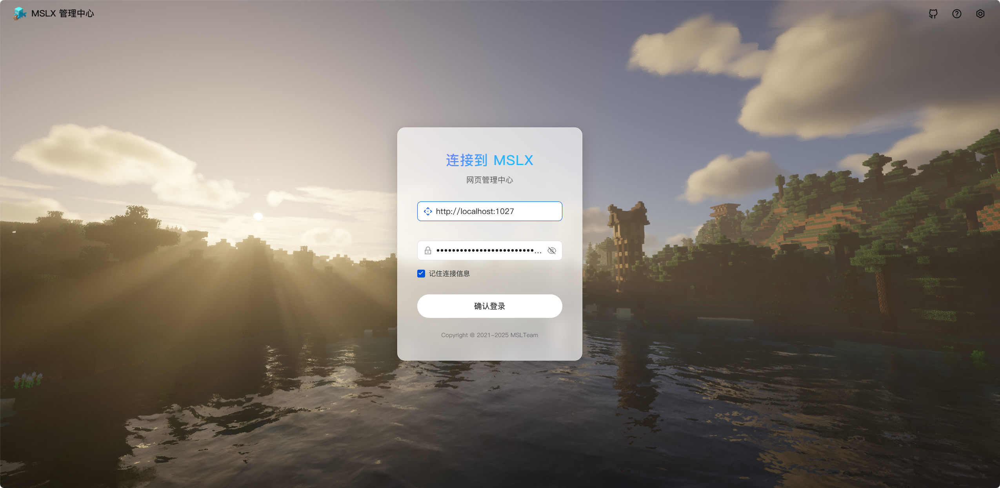
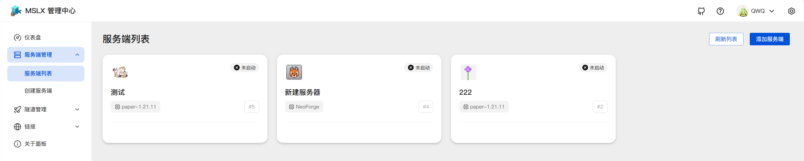
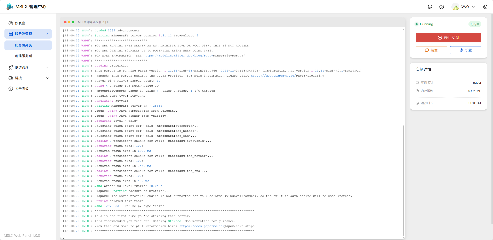
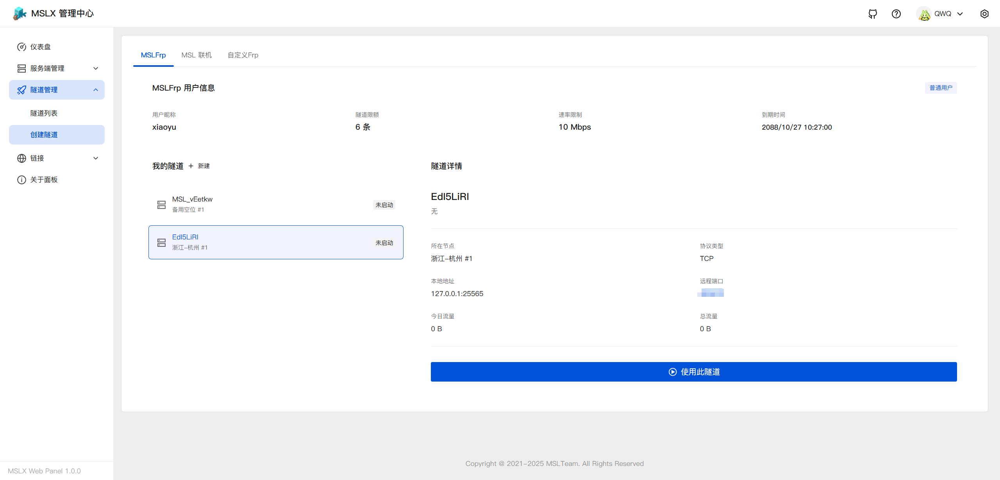
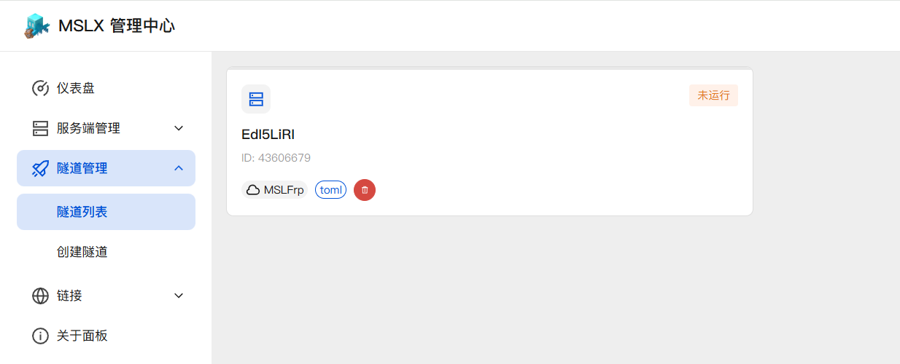
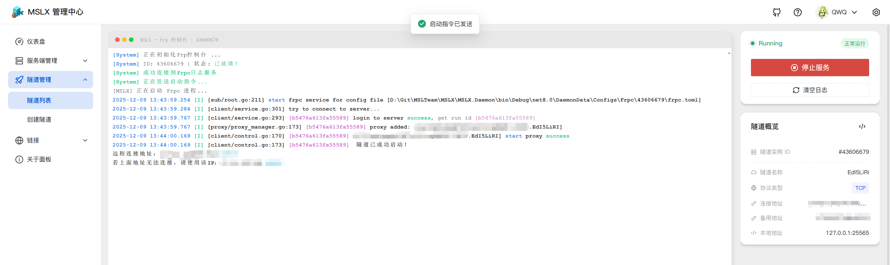
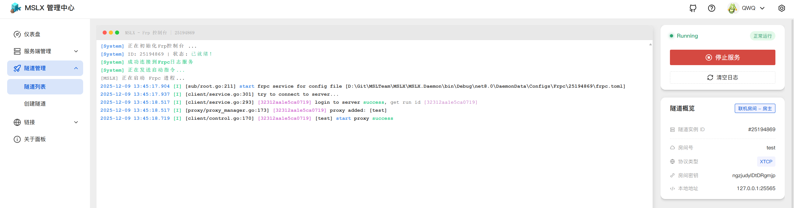

## 项目介绍

==MSLX== 是由 [**MSL**](https://www.mslmc.cn) 原班团队 **MSLTeam** 倾力打造的全新一代开服工具。基于 ==.NET Core 8.0== 环境。

它传承了 MSL 经典的 UI 设计语言，旨在让操作零门槛——无论是老用户还是新伙伴，都能即刻上手，极速部署您的 MC 服务器。

MSLX 不仅 ==完美支持跨平台== (Windows / macOS / Linux) 运行，相比前代，更引入了强大的 ==远程访问== 功能，让管理更自由。

<RepoCard repo="MSLTeam/MSLX" />

::: warning 之前的MSLX呢？

已经倒闭了！就是这个↓↓↓

:::

新版本的MSLX采用了 ==前后端分离== 的设计模式，计划有两套前端可供选择使用：网页控制台/跨平台支持的桌面客户端。当然，后端也是跨平台支持的。!!听不懂没关系，只需要知道，MSLX整体均支持跨平台使用。!!

## 开发进度

目前已完成服务器创建以及启停控制，隧道创建以及启停控制。

优先开发的是后端+网页控制台前端，桌面客户端将在前者功能较完善后开始开发。

更多基础功能还在陆续开发中......

## 开发展示

==连接页==

==仪表盘（首页）==

==服务端列表==

==服务端创建==

==服务端控制台==

==创建隧道== （目前已完成对MSLFrp，MSL 联机，以及自定义配置文件的支持，更多服务商将在后续接入...）

==隧道列表==

==隧道控制台== （普通隧道）

==隧道控制台==（联机隧道）

目前就是这么多啦~ 更多功能还在陆续开发中~
