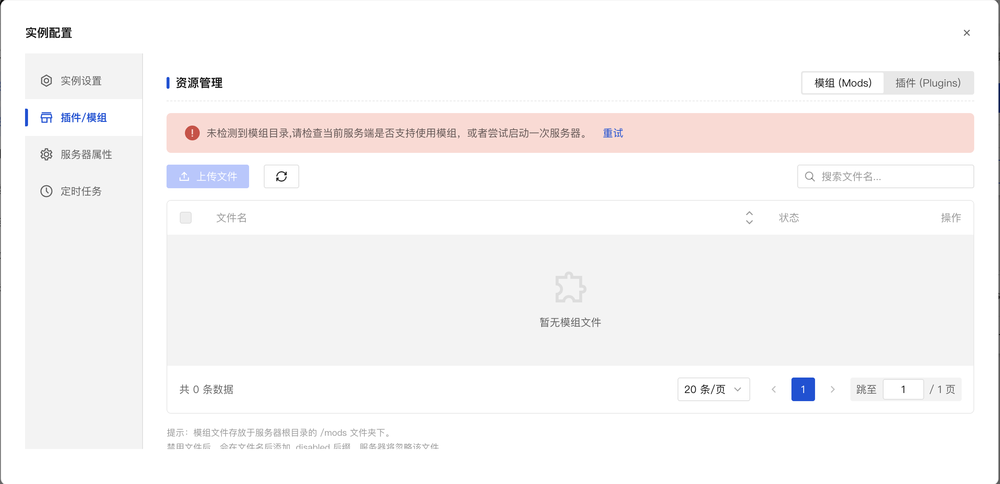
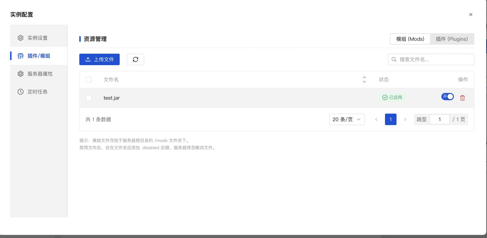
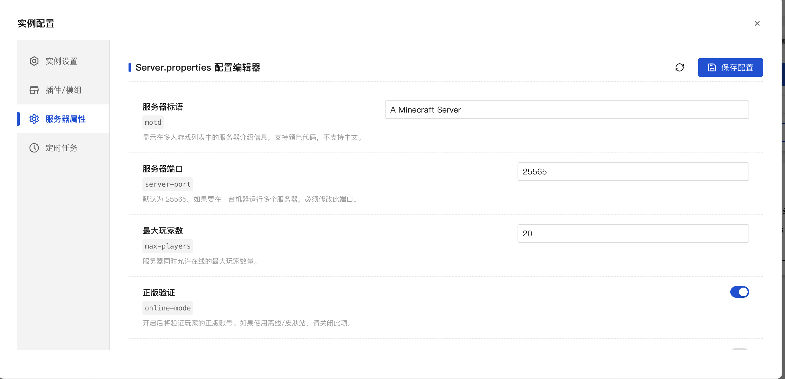

## v0.1.1 - alpha

::: tip 加入测试

目前MSLX正在内测，欢迎加入体验哦～

[>>>加入测试 **MSLX官网**](https://mslx.mslmc.cn){.read-more}

:::

### Feat - 定时任务

### Feat - 模组/插件管理页面

### Feat - 服务器配置文件可视化编辑

### Perfect - 一些优化

- 更新了首页公告的接口，现采用MSLX独立公告内容。
- 文件管理页面补充支持新建文件夹。
