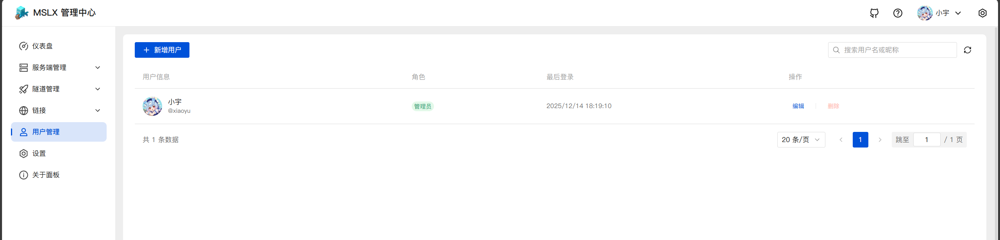
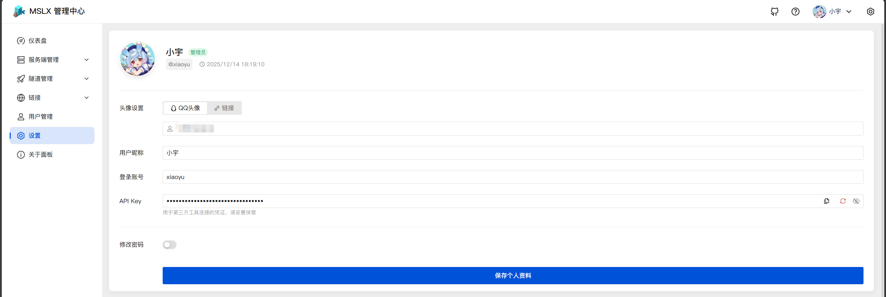
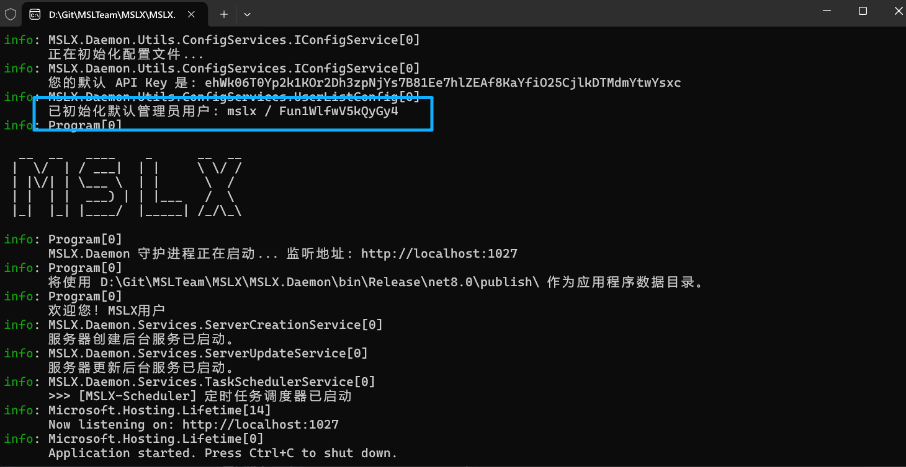
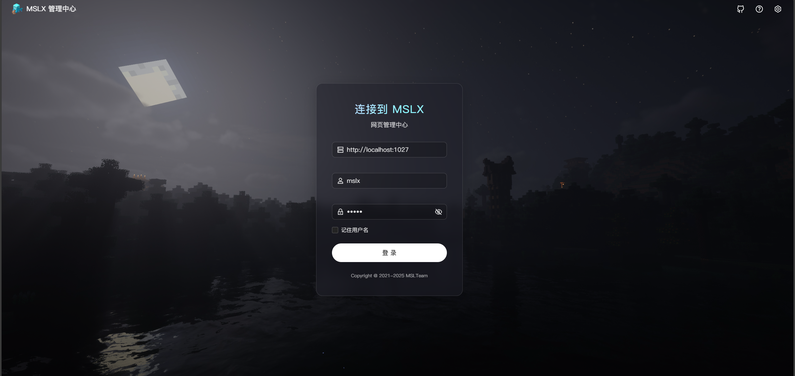

## v0.2.0-alpha

::: tip 加入测试

目前MSLX正在内测，欢迎加入体验哦～

[>>>加入测试 **MSLX官网**](https://mslx.mslmc.cn){.read-more}

:::

### Dependency - 升级框架到 .NET Core 10.0 LTS

在 ==v0.2.0-alpha== 版本中，我们将框架版本从 .NET Core 8.0 升级到了 .NET Core 10.0。

内测用户可能需要重新安装环境才能运行新的测试版本。

[>>>查阅文档 **MSLX官网**](https://mslx.mslmc.cn/docs/install/start/){.read-more}

### Feat - 用户系统

在此版本，网页控制台 ==不再支持APIKey== 的登录方式，换用全新的 ==用户系统== 。

!!不过，接口仍然支持APIKey的鉴权方式，目前留作客户端连接使用。!!

::: tip 初始账户

首次启动时，会生成一个初始账户。

用户名：`mslx`

密码：`随机`

:::

::: warning WIP

目前用户系统仅完成初步的登录和管理设计，==暂未支持给普通用户分配资源=={.warning} ，所以也请暂时不要创建普通用户使用。

:::

### Feat - 实现Web控制台的本地化部署

目前发布的 ==v0.2.0-alpha== 版本已嵌入前端资源，可以直接访问软件监听地址打开Web控制台。

若需要外网访问，可以使用 ==反向代理== 或者 ==内网穿透== 实现，仅需映射`MSLX.Daemon`的服务端口即可。

==外网访问**强烈建议**使用SSL连接。== 

::: tip 在线控制台

以前的控制台仍会继续按照发布版本更新。

若您觉得外网访问您的控制台较慢，您可以继续使用在线控制台远程连接。（在线控制台采用全球加速CDN）

（不同的是，使用本在线控制台您需要额外输入连接地址，并且如果连接的不是本地地址，您需要给守护进程套 ==SSL==）

:::

### Feat & Fix - 一些优化 & Bug修复

- 修复了编码错误导致的无法正常关闭服务端的问题
- 新增了文件编辑器的编码设置
- 对于在Windows系统下，创建服务端默认编码均使用 ==GBK== 
