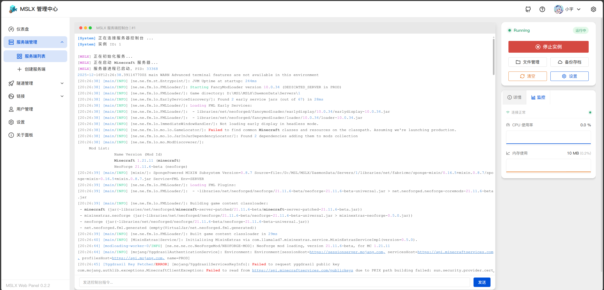
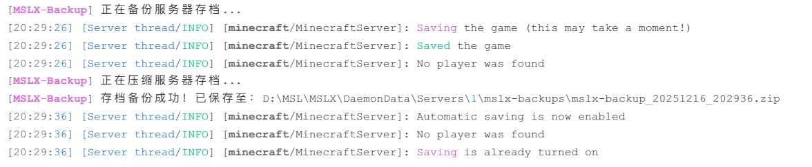
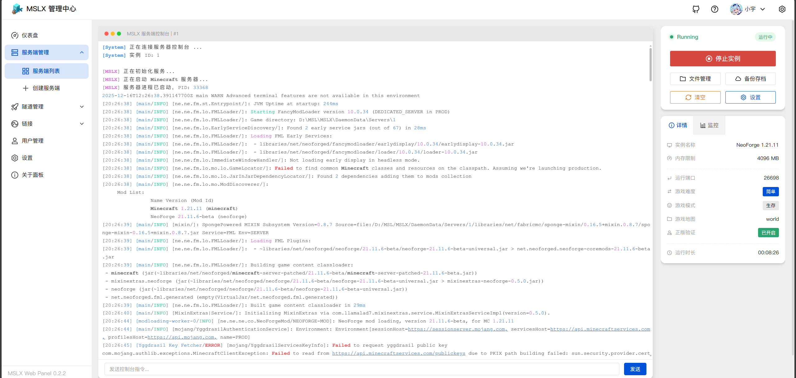
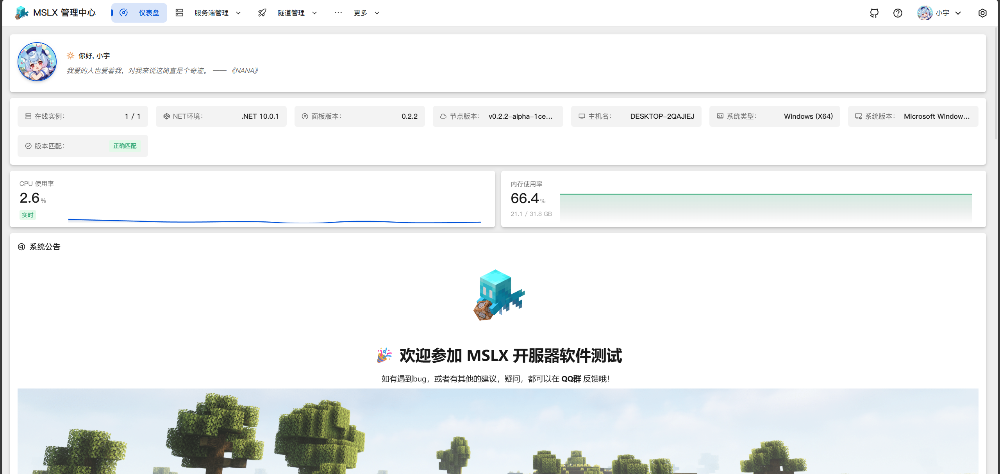

## v0.2.2-alpha

此版本对部分预留的功能进行了完善，网页控制台和守护进程端完成度大概在 ==90%==，预计下一个版本将进入 ==beta== 版本状态。

### Feat - 资源状态监控

- 在仪表盘页面（首页）新增了资源监控图表

- 在服务端实例控制台页面新增当前服务端进程的资源监控图标

### Feat - 完成存档备份功能

备份操作逻辑与MSL软件内一致，支持手动备份和自动备份

!!这项MSL鸽了4年的功能，在MSLX的alpha版本就实装了！!!

可以在 ==定时任务== 中直接设置备份计划

### Feat - 实例控制升级

已完成对 ==崩溃自动重启== 和 ==随守护进程自启动== 的功能

### Feat - 外置登录支持

已完成与MSL内一致的 ==自动配置外置登录== 功能，仅需要设置外置登录的API地址，即可一键开启外置登录支持。

### Feat & Fix - 优化和功能修复

- 网页控制台UI优化 - 在服务端控制台页面新增一些MC配置的显示，以及新增更好看的命令输入框
- 优化了PC端横向菜单布局的显示效果，修复部分子菜单项错位问题
- 修复了部分ANSI日志染色出错的问题

