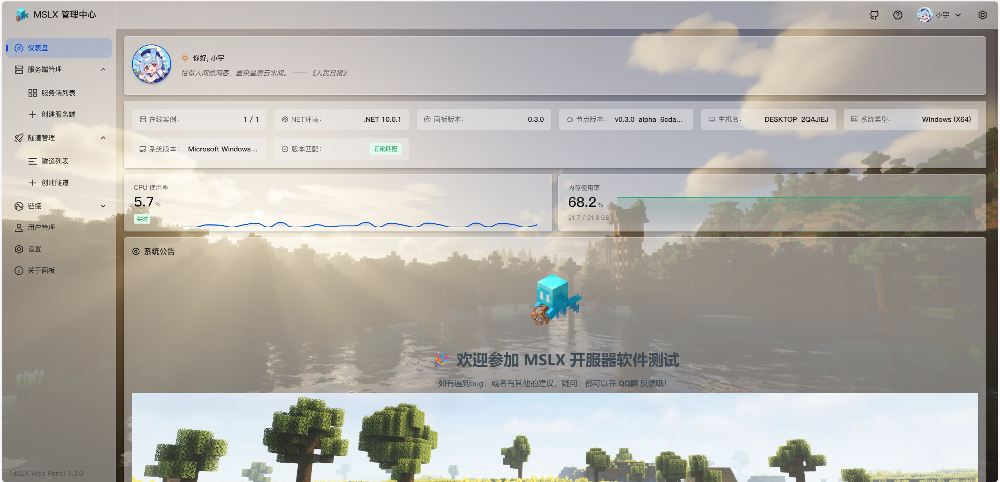
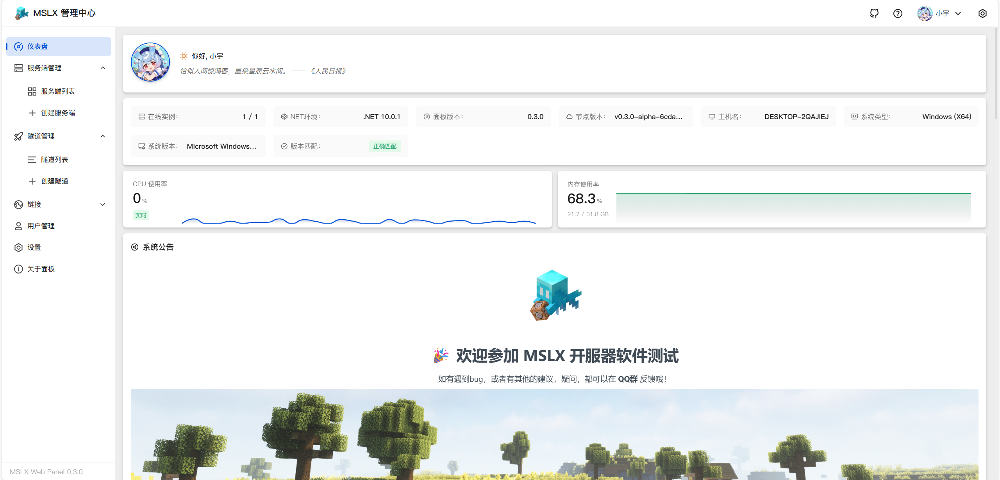
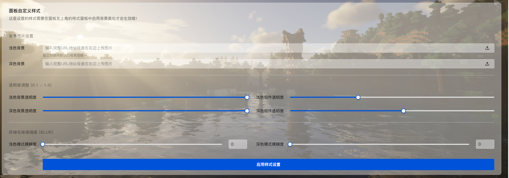

## v0.3.1/v0.3.0-alpha

这两个版本主要完成了对 ==网页控制台== 自定义主题的支持，以及一些细节的完善和bug修复。

### Feat - 自定义主题

==启用背景图是一定会造成可阅读性下降的，请自行斟酌是否启用。== !!好看才是第一对吧！!!

### Feat - 细节完善

- ==文件管理器== 内新增复制和移动文件的功能
- 更新Java版本选择提示（26.1+版本需要Java25）
- 第一次启动时添加了更直观的账号密码提示
- 修复切换页面可能错误弹出错误信息（v0.2.3-alpha）
- 优化文件管理器在手机端的样式（v0.2.3-alpha）
- 内存调整支持GB单位（v0.2.2.1-alpha）
- 更新Frp隧道列表排序规则（v0.2.2.1-alpha）
- 添加了一只应急食品，猜猜她在哪？（v0.2.2.1-alpha）

### Fix - Bug修复

- 修复面板样式设置点击一次后立马退出的问题
- 修复了自动重启的熔断功能无效的问题
- 修复切换实例控制台可能导致的配置弹窗货不对版（v0.2.2.1-alpha）
