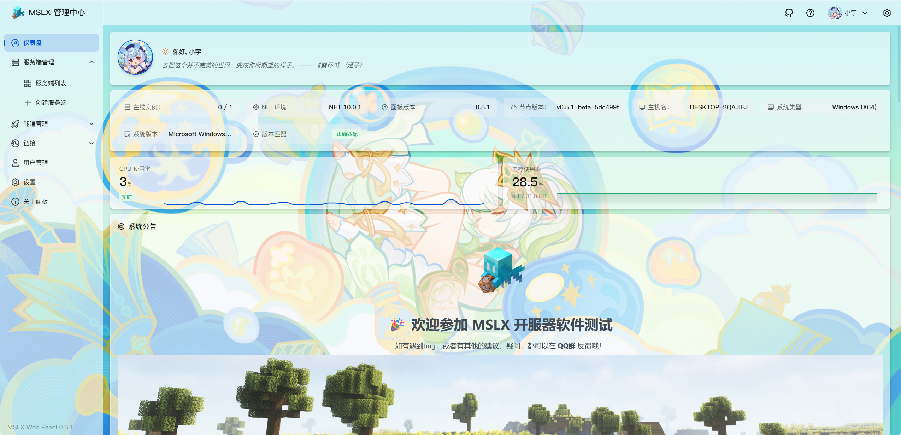

## v0.5.1-beta

经过一个星期的 ==alpha== 版本迭代，目前MSLX的 ==网页面板+守护进程== 功能已经基本完成，基本上可以正常使用了。

现在 ==alpha → beta== 版本。我们预计在 ==2026年1月== 发布 ==MSLX正式版本==（不含客户端版本）。

欢迎大家提供更多的反馈！

### Fix - 问题修复

- 修复开启背景美化后服务端核心选择组件变成透明的问题
- 修复创建服务器页面在自定义背景模式下丢失容器背景色的问题
- 修复在Windows下Java选择Java Path和环境变量时无法正确监控资源的问题
- 修复一些循环任务在退出时报错
- 修复文件管理器无法下载大文件的问题

::: warning 关于文件资源

由于目前文件下载功能做的比较的 ==质朴=={.warning}

==请不要向他人分享您的<b>文件的下载地址</b>和<b>服务器图标的资源地址</b>=={.warning}

否则可能会导致他人可以盗用您的账户

:::

### Perfect - 优化

- 调整服务端选择组件的高度和宽度，在PC端更容易选择服务端核心
- 配置默认日志级别，防止过多日志的输出
- 减少启动任务等待时间
