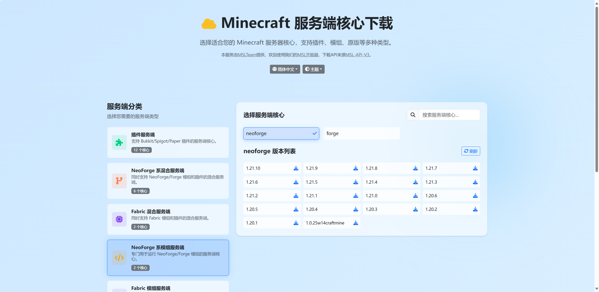
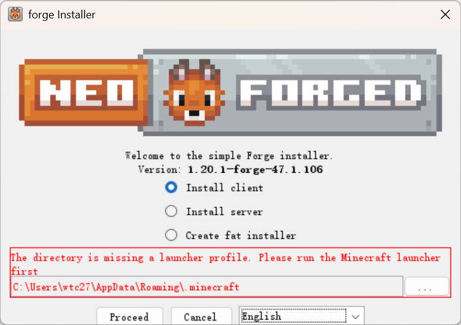
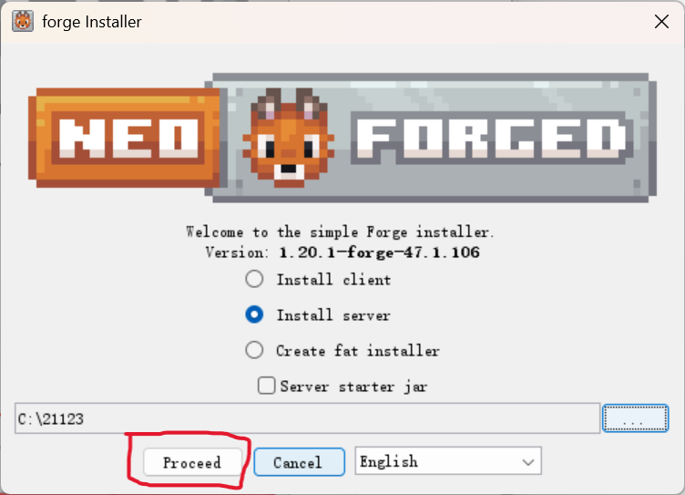
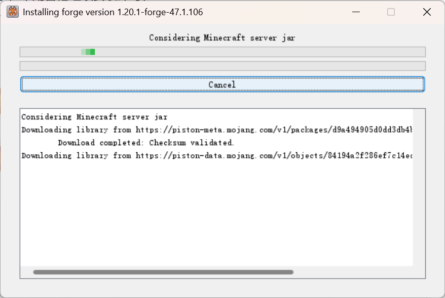
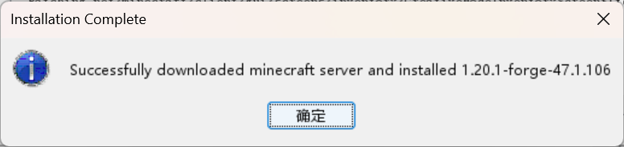
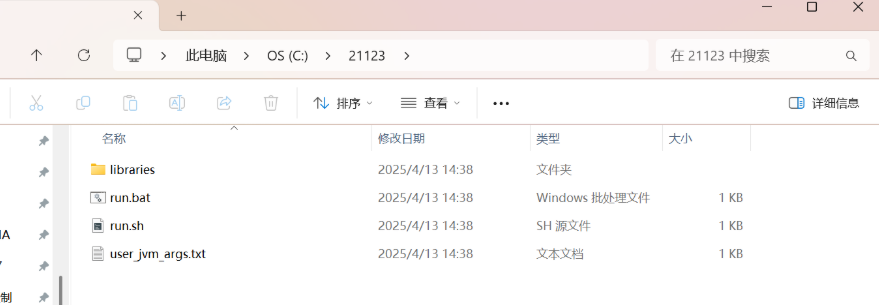
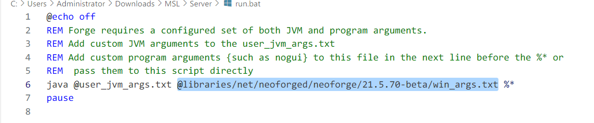
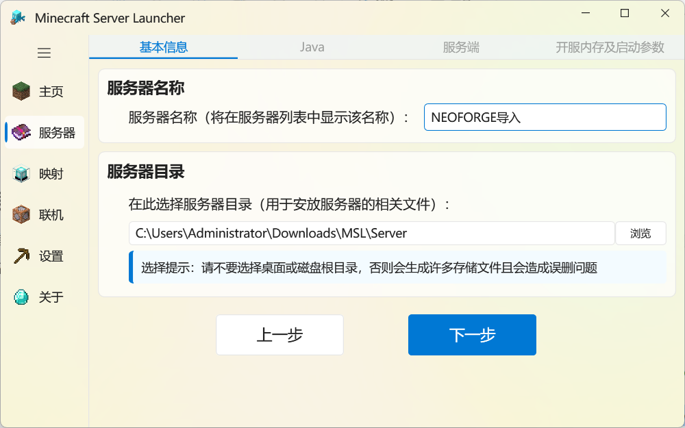
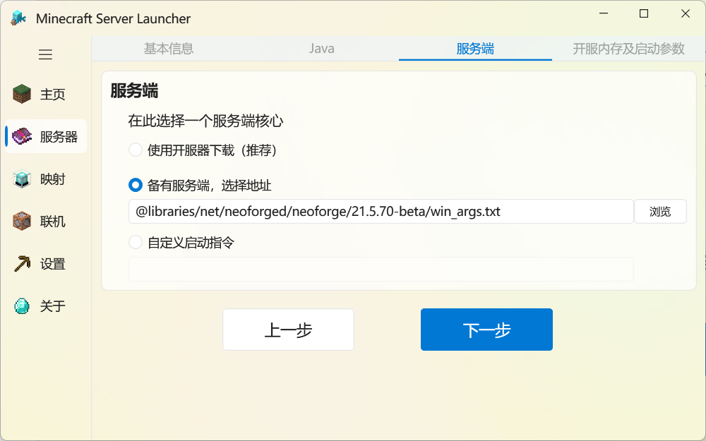
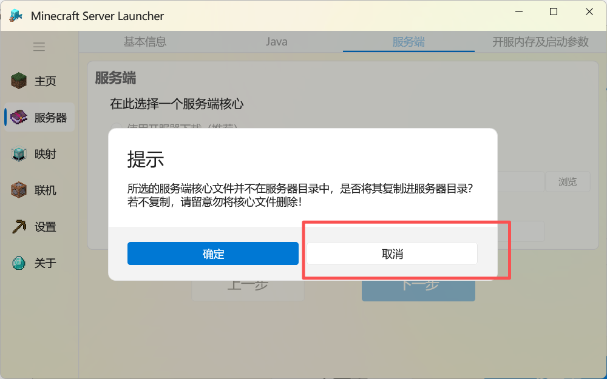

::: tip TIPS

本篇教程适用于高级用户，如无特殊情况，请通过 ==MSL的创建服务器流程== 完成`NeoForge/Forge`的下载和安装，MSL安装时会自动采用 ==镜像源== ，下载速度会比官方安装程序快很多。

本文章安装的演示版本为`1.20.1-NeoForge`，其他版本的NeoForge/Forge的安装流程均类似。

注意：由于安装程序是`jar包`，您首先需要安装 ==合适版本的Java== 才能运行安装程序。

[前往**下载Java**](https://www.oracle.com/cn/java/technologies/downloads/){.readmore}
:::

:::: steps

1. ### 下载NeoForge/Forge安装程序

   首先您需要下载一个`NeoForge/Forge`的安装程序，您可以前往MSL服务端镜像站下载。也可以前往`NeoForge/Forge`官网下载。

   [MSL服务端镜像站](https://dl.mslmc.cn){.readmore}

   

   下载完成后将会得到一个这样的安装程序jar包：

   

2. ### 运行NeoForge/Forge安装程序

   双击此文件运行安装程序，或者在 ==终端== 输入 `java -jar 文件名.jar` 来启动安装程序。

   会出现如下窗口：

   

   此时，请选择 ==Install Server== 并选择您需要安装服务端的文件夹位置，然后点击 ==Proceed== 即可开始安装。

   

   接下来只需要一杯咖啡☕️的时间，等待安装完成~

   由于是官方源安装，很可能出现 ==下载卡着== 的问题，这种情况请尝试更换您的网络环境。!!或者老老实实用MSL安装就好了。!!

   

3. ### 完成安装

   出现此弹窗提示即为安装成功：

   

   文件夹内容应该类似如下，可以直接双击`run.bat`启动您的服务端了。

   

4. ### 导入到MSL中使用（可选）

   首先，在刚刚的文件夹，使用 ==记事本/VSCode== 等文本编辑工具打开`run.bat`文件，将如图所示的文本复制，`@`开头到`txt`结束。

   

   接着来到 ==MSL-创建服务器-自定义模式==，选择您刚才安装的文件夹。

   

   选择合适的 ==Java版本== 然后下一步。

   到这里，选择 ==备有服务端== 填入刚才在`run.bat`复制的参数。

   

   此时，MSL会提示服务端不在目录，是否需要复制，请务必点击 ==取消==。

   

   之后的参数正常填写即可，导入就完成了。

::::

