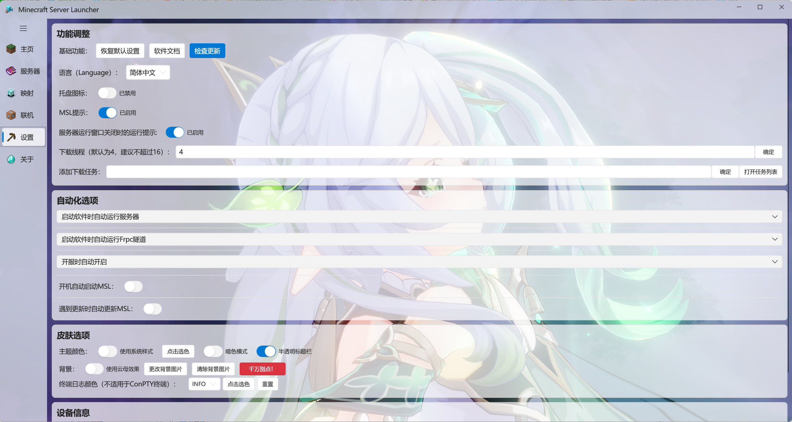
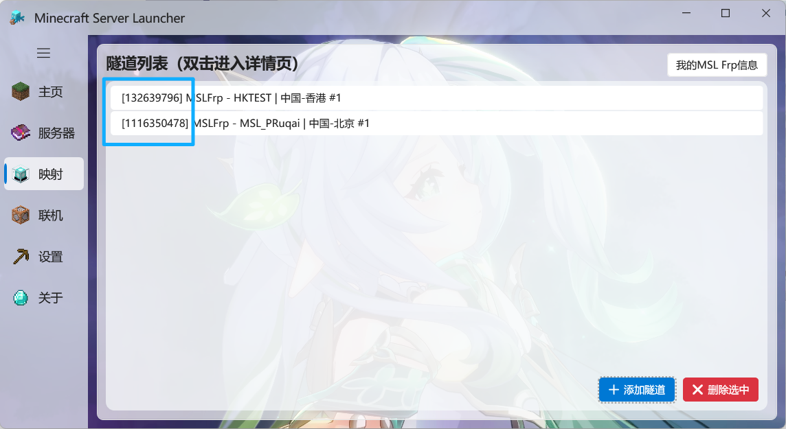
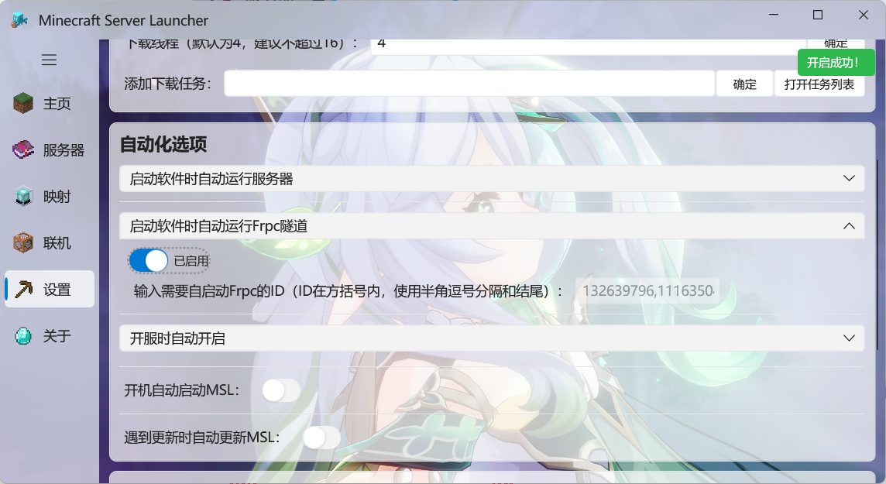

这是MSL的设置页面:

大部分设置项目都比较通俗易懂，不再进行详细说明。

## 配置Frp自动启动

:::: steps

1. ### 获取需要自启动的Frp的ID

   进入 ==映射== 选项卡，如图中所示 ==中括号== 内的数字即为Frp隧道的ID，请记下来。

   

2. ### 配置自启动

   在 ==MSL设置== ，==自动化选项== 中填入Frp隧道的ID。

   如果只需要自启动一个隧道，可以 ==直接填入此隧道ID==。

   若需要自启动 ==多条隧道==，请填入多个ID，并使用半角（英文）逗号`,`分割。如：`123,321,`

   填写完成后打开开关即可。

   

   

::::

## 皮肤设置

最下面还有皮肤选项:

==Mica云母== 效果仅支持Windows11。

随你喜好调整:-)

!!如果你一定要点“千万别点”，那么，Just Do It.!!

