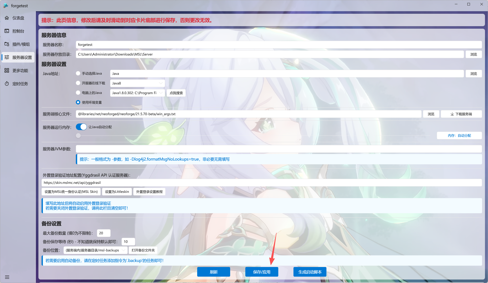
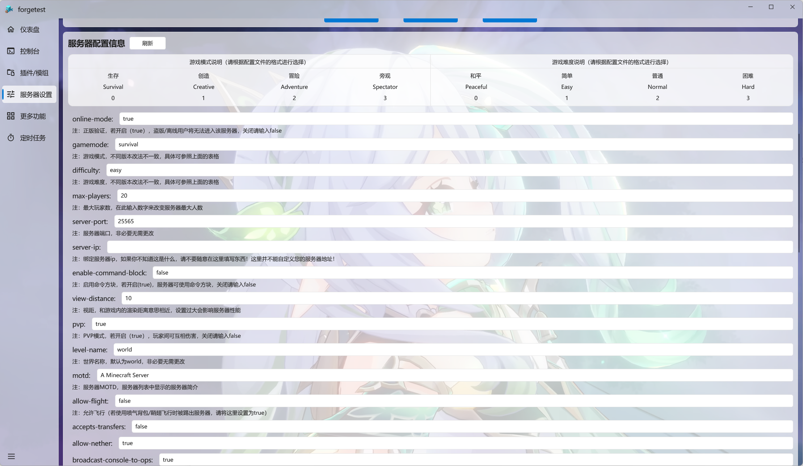
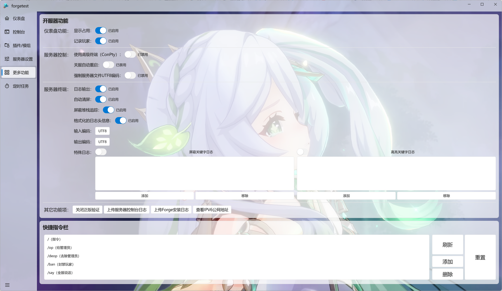

## 服务器参数配置

此页面大部分内容都十分 ==通俗易懂== ，唯一的问题是不要 ==点错保存按钮==了，这里有两个保存按钮，下面的那个保存按钮是和服务器配置文件有关的。

## 服务器配置文件

这是对应的`server.properties`文件的内容，相关配置项都写了说明，有需要的话按照标注修改即可。

==记得保存就行！== !!欸嘿？还是记得保存哦~!!

## 更多功能

基本都是字面意思了 !!MSL多贴心啊!!。==不懂的内容不要乱改哦==。

唯一需要注意的是如果服务器的输入输出出现 ==乱码== 的情况，可以尝试更换 ==输入/输出的编码为`ANSI`。

