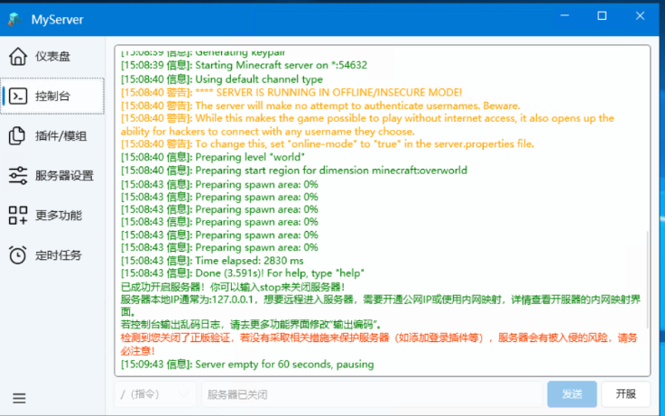

::: tip
善用 ==搜索== 功能，也许可以帮您快速找到您的问题的解决方案~

如果这里的常见问题都没能解决您的问题，您可以在右侧找到我们的 ==QQ交流群== 加入与群友们探讨解决。

:::

## 服务器开了进不去

这种情况吗？

==您真的开了吗？==

## 下载时提示: 通常不会下载MSL.exe...

如图：

点开右边···，然后点击保留。

然后选择仍然保留即可。

::: tip 为什么会出现此提示？MSL不安全吗？

MSL是一款 ==开源软件== ，代码 ==100%公开==，请您放心使用。

由于我们并没有给软件签名，出现此误报是很正常的。

当然，如果您仍认为本软件不安全，您可以选择不用。

:::

## 打开提示病毒，或者Windows安全中心提示有病毒给程序删了

==进入安全中心，保护的历史记录，恢复即可。==

或者您可以给MSL所在文件夹添加 ==白名单==。

::: tip 为什么会出现此提示？MSL不安全吗？

MSL是一款 ==开源软件== ，代码 ==100%公开==，请您放心使用。

由于我们并没有给软件签名，出现此误报是很正常的。

当然，如果您仍认为本软件不安全，您可以选择不用。

:::

## 内网穿透Frp提示计算机主动拒绝/端口不匹配
如果内网穿透日志输出提示以下文字:

> **无法建立连接，因为计算机主动进绝了它。**
>
> **请检查服务器是否开启或内网映射本地端口和服务器本地端口是否匹配！**

这种情况 99% 是 ==服务器端口和内网映射配置的本地端口不匹配== 造成的。

首先，在 ==服务器配置==中查询您配置的 ==本地端口==。

然后在 ==Frp创建隧道== 填写配置参数时，请保证 ==本地端口== 和您上述查询到的服务器本地端口一致。

并且，如无特殊需求请不要修改本地地址的`127.0.0.1`。

## 内网穿透Frp提示连接超时

- 检查 ==节点是否在线==。
- 如果使用的是 ==非中国大陆境内节点== ，可能由于链路问题导致无法连接，建议更换节点。
- 如果您启用了 ==KCP== 协议传输，请尝试关闭。

## NeoForge/Forge安装失败导致无法开启服务器

大概是这种情况：

这种情况很容易辨认：==安装了NeoForge/Forge但是没有安装任何模组都无法启动==。基本就是这个问题。

可以尝试的解决方案：

<Card>

- 尝试直接 ==重新创建服务器==。
- 尝试直接 ==重新创建服务器==，并且在 ==NeoForge/Forge安装== 时，在右下角点击 ==命令行安装==。（如果MSL可以正常下载资源文件，建议在资源文件全部下载成功后再点击）。
- 尝试切换您的 ==网络环境==，后 ==重新创建服务器==，并且在 ==NeoForge/Forge安装== 时，在右下角点击 ==命令行安装==。

</Card>

## 安装NeoForge/Forge时提示429

这是因为你在一天/一小时之内安装次数过多，为了防止被恶意刷流量，所以限制了次数!!（但是也不至于安装了二十几次吧）!!。

如果你还想安装，请在NeoForge/Forge ==安装界面的右下角== 点击 ==改用命令行安装==（由于采用官方源，可能会出现部分人下载较慢或者下载失败等情况）。

## Fabric/插件端一直显示下载服务端（Downloading···）

部分服务端需要自动下载 ==原版服务端== 作为依赖。

==新版本MSL== 已经会自动处理此类下载任务，建议您在服务器设置页面从 ==MSL重新下载服务端核心== 即可解决此问题。

## 使用内网穿透地址进入服务器出现虚空或者过一会连接超时

请尝试更换其他节点使用，此问题可能是 ==节点负载过高== ，或者 ==节点带宽不足== 导致的。
若您正在使用 ==非中国大陆境内== 的节点，可能是由于延迟过高导致，建议更换 ==中国大陆境内节点==。

## 关闭正版验证后皮肤显示错误

由于关闭了正版验证，不再由正版服务器提供皮肤，您需要通过以下方式来支持皮肤显示。

<LinkCard title="外置登录配置教程" href="/docs/advanced/yggdrasil/" icon="cloud" description="使用外置登录（皮肤站）的方式恢复皮肤的显示。" />

<LinkCard title="万用皮肤补丁" href="https://www.mcmod.cn/class/883.html" icon="shirt" description="使用万用皮肤补丁模组恢复皮肤显示。 此模组仅允许客户端安装，且仅对装了本模组的玩家互相可见。" />

## 单人存档（地图）如何迁移到服务器

::: tip 提醒

在迁移地图数据之前请将玩家的物品放到箱子里（单人玩家的数据与服务器玩家数据不互通）！

:::

1. 打开单人存档所在位置（saves文件夹下），双击世界文件夹，将该文件夹下的所有文件全部复制。
2. 然后打开服务器根目录下的 ==world== 文件夹，将此文件夹原有内容清空后粘贴文件（若原服务器存档有数据，请备份），这样就完成了地图数据的迁移。

## 如何启动 原神·空月之歌 ？

<Card>

<LinkCard title="国服 | 天空岛" href="https://ys.mihoyo.com/" icon="cloud" />

<LinkCard title="国际服" href="https://genshin.hoyoverse.com/zh-tw/" icon="earth-asia" />

<LinkCard title="国服 | 明霄升海平 ?" href="https://webstatic.mihoyo.com/ys/event/e20210203-fab" icon="folder-minus" />

</Card>
