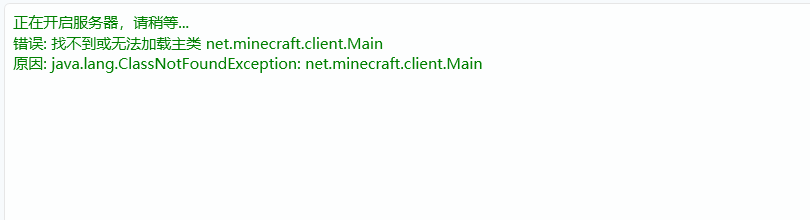
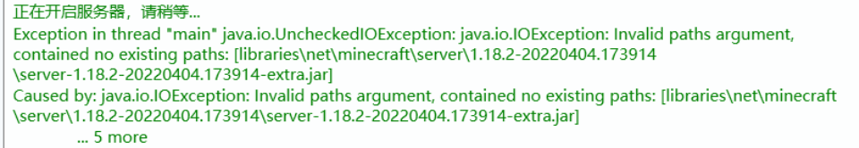
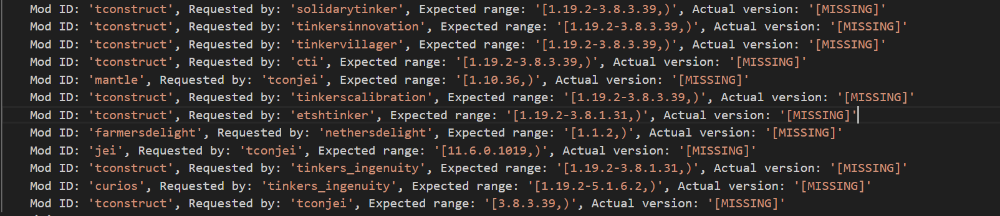
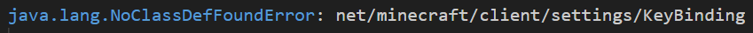
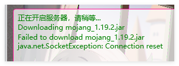
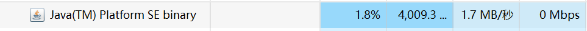
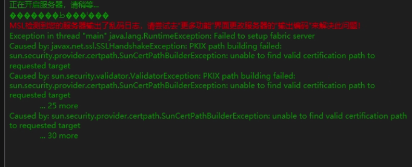

::: tip 注意！

请首先检查服务器 ==目录路径== 是否有中文以及 ==Java版本是否选择正确！== 

- 1.12.2-  <Badge type="tip" text="Java 8" />
- 1.13-1.16.5 <Badge type="tip" text="Java 8 / 11" />
- 1.17/1.17.1 <Badge type="tip" text="Java 16" />
- 1.18-1.20.4 <Badge type="tip" text="Java 17 / 更高版本" />
- 1.20.5+ <Badge type="tip" text="Java 21 / 更高版本" />
- <Badge type="warning" text="如无必要，请使用推荐版本即可，用更高版本可能出现兼容性问题。" />

:::

## NeoForge/Forge的崩溃输出

### 安装了仅客户端类型的模组/存在不兼容的模组

通常表现是存在日志: `failed to load correctly` 。

那么请删除不兼容的模组，划红线的是你要删除的模组，此时请在 ==插件/模组== 页面或者 ==mods文件夹==删除相关模组，并尝试重新开服。

### 提示未找到主类

类似如图：

看到 ==client字样== 的 99% 都是 ==客户端的核心用在了服务==，这是行不通的。

你可以去寻找关于该整合包的 ==服务端== ，或者尝试自己手搓服务端（说简单点就是资源同步），比如 1.21.1-NeoForge ，你客户端和服务端都必须是这个版本，然后是资源同步（直接把客户端版本下的所有文件夹全部复制粘贴，并且 ==排除客户端模组== ）。

如果不是这种，而是提示`未找到主类@...`，那么大概率是 ==Java版本不对== 。

### NeoForge/Forge安装失败

通常存在日志：`server-xxx-extra.jar` 或者 `Invaild paths argument` 。

此类情况大概率就是安装失败了，尤其是没装任何模组都无法启动的情况。

请尝试重新安装服务器。

[或者查看：**NeoForge/Forge安装失败导致无法开启服务器**](/docs/faq/#neoforge-forge安装失败导致无法开启服务器){.readmore}

### 缺少前置模组

通常存在日志：`Requested by`。基本就是 ==缺少前置==，如下图：

安装日志提示的缺少的模组即可，如果看不懂可以去 ==翻译==，或者问问AI。

### 客户端模组错误安装在服务端

通常存在如下日志：`net/minecraft/client` 。

这里看到有个 ==client路径== 字样，这表示 ==仅支持客户端的模组== 放到服务器里了，建议自行查一遍模组列表，并删除这些服务器不支持的模组。

## Fabric的崩溃

### 服务端下载原版依赖失败

出现类似日志：`Downloading mojang_1.xx.x.jar`。这个是服务端正在下载原版服务端作为依赖，可能由于网络环境不好导致下载失败。

[请参考 **Fabric/插件端一直显示下载服务端（Downloading···）**](/docs/faq/#fabric-%E6%8F%92%E4%BB%B6%E7%AB%AF%E4%B8%80%E7%9B%B4%E6%98%BE%E7%A4%BA%E4%B8%8B%E8%BD%BD%E6%9C%8D%E5%8A%A1%E7%AB%AF-downloading%C2%B7%C2%B7%C2%B7){.readmore}

## 其他类型崩溃（各服务端通用类型）

### 端口占用

通常存在类似日志：`端口已被占用` 或者 `bind port ···` 。

- 如果您在同一台电脑需要开启 ==多个服务端== ，您需要前往 ==服务器配置== 页面修改服务端的端口，不同服务端的端口 ==不可一样==。
- 如果您没有开启多个服务端，可能是您之前的服务端因多种原因在后台偷偷运行了，请在任务管理器右击该程序（Java）然后点击 ==结束任务 ==。如果您不知道怎么结束，也可以直接 ==重启电脑== 。

### 服务器SSL错误

这种情况比较少见，通常存在日志：`PKIX path building failed` 或者 `SunCertPathBuilder` 又或者 `java.net.ssl` 。

这种问题通常是因为一些本地代理软件导致的（Java默认不信任用户安装的证书），如`Steamcommunity_302`。

解决方案：在 ==服务器设置== 页面找到 ==服务器JVM参数== ，输入`-Djavax.net.ssl.trustStoreType=Windows-ROOT`，然后保存即可。