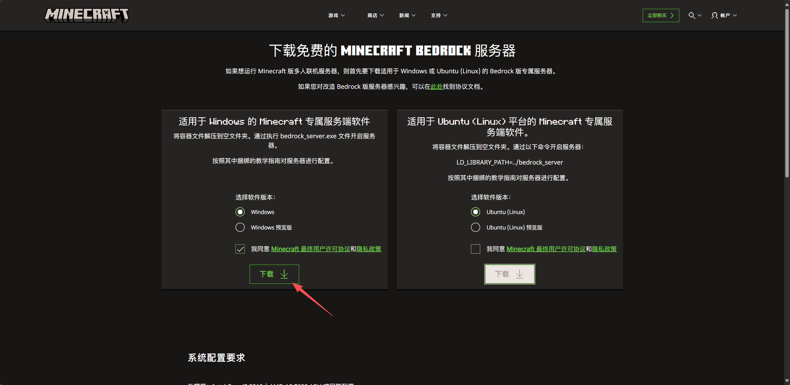
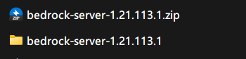
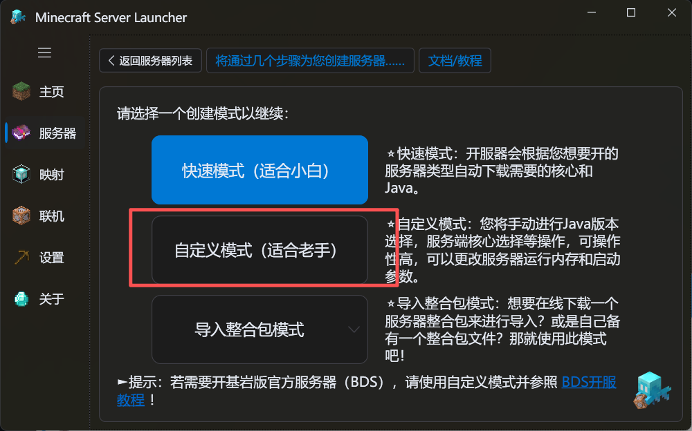
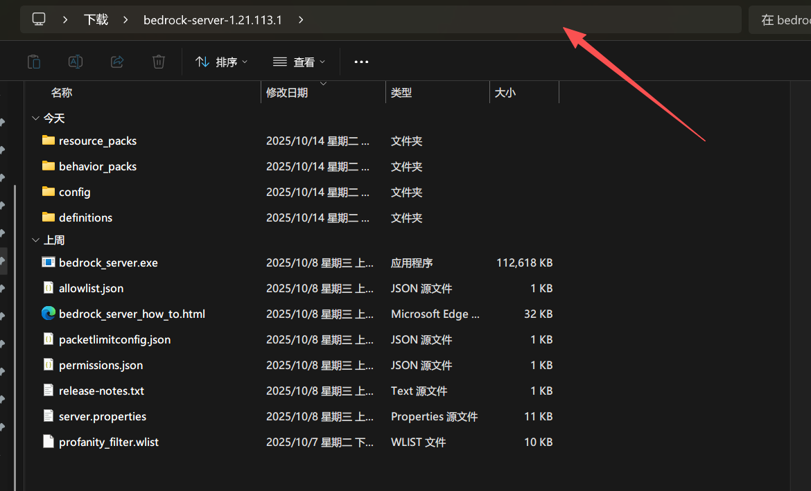
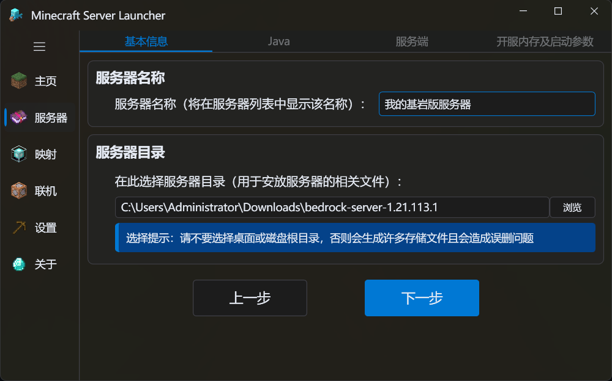
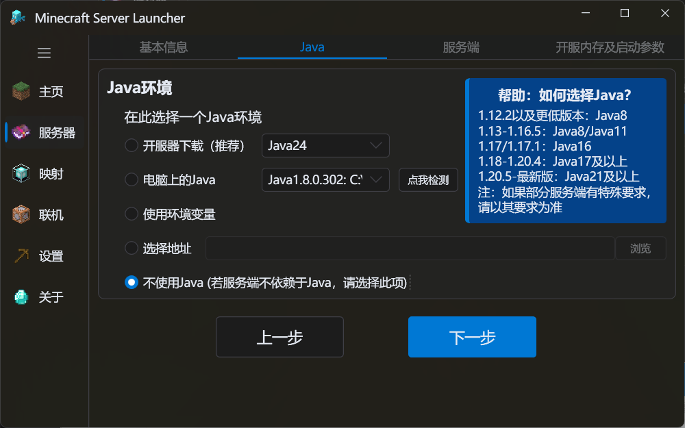
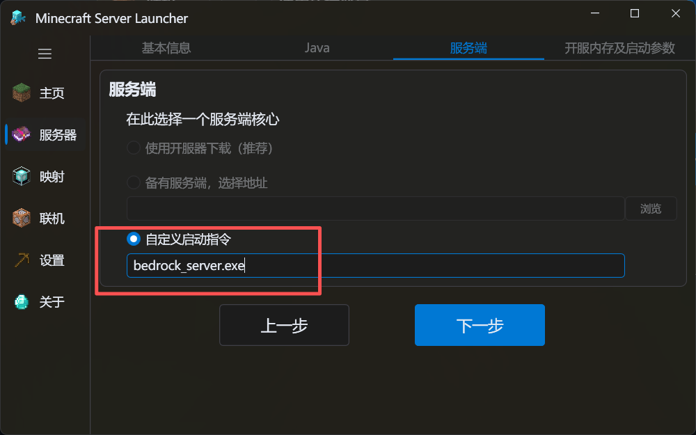
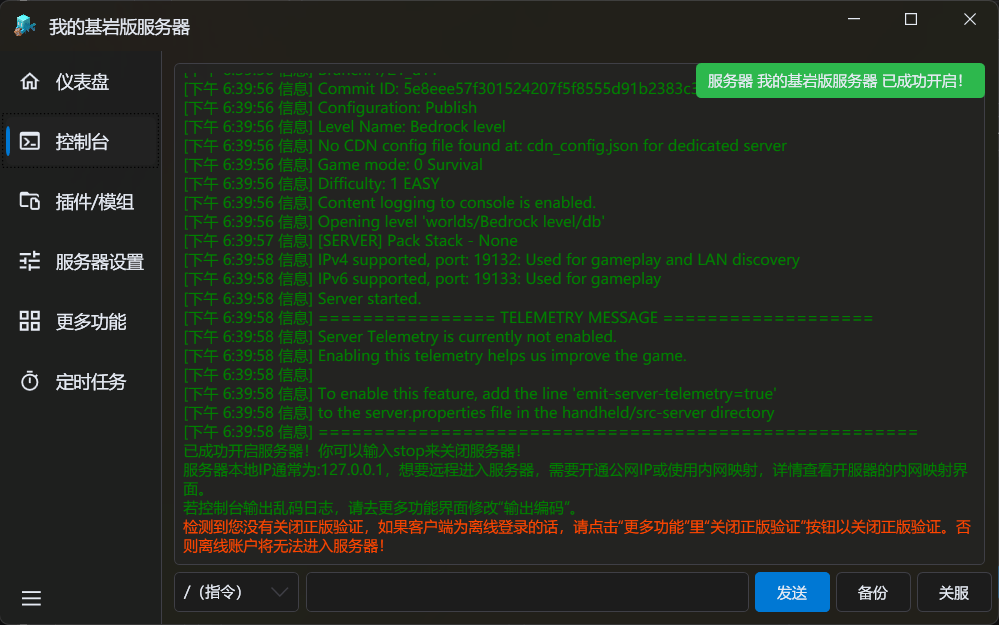

## 视频教程

这是热心群友 [七灝seven](https://space.bilibili.com/2112152080) 制作的视频教程↓↓↓

@[bilibili](BV1NzZpYZEjZ)

<LinkCard title="前往bilibili观看" icon="b:bilibili" href="https://www.bilibili.com/video/BV1NzZpYZEjZ/" />

## 图文教程

:::: steps

1. ### 下载 & 解压服务端文件

   首先，前往下载一个BDS服务端软件：

   <LinkCard title="基岩版服务器下载 | Minecraft" icon="download" href="https://www.minecraft.net/zh-hans/download/server/bedrock" />

   

   接着，解压压缩包到一个你喜欢的地方

   [不会解压？**【电子扫盲课】【小白必看】如何解压压缩包？**](https://www.bilibili.com/video/BV1xZ4y1v7pU/){.read-more}

   

2. ### 导入到MSL中

   进入创建服务器页面，选择自定义模式（目前快速模式暂不支持创建BDS服务端）

   

   接着， ==服务器目录== 选择为你刚刚解压出来的文件夹。

   ::: tip 小技巧

   点击这个位置可以编辑路径，可以在这里快速复制路径哦~

   

   :::

   

   下一步，请选择 ==不使用Java== 。

   

   下一步，在 ==自定义指令== 处输入`bedrock_server.exe`。（这是您的基岩版服务端程序）。

   

   下一步，选择终端模式（[终端模式的区别？](/docs/mc-server/start/#配置服务器参数)），然后即可完成您的基岩版服务器创建。

3. ### 开启服务器

   开启服务器，出现 ==成功开启== 的提醒即成功开启了您的基岩版服务器。

   

   接下来就可以连接到您的服务器了。

   ::: tip TIPS
   基岩版默认端口是19132  

   使用的协议是udp

   :::

   若服务器和游戏在同一台电脑上，IP地址输入`127.0.0.1`。否则您需要使用公网IP/内网穿透以允许他人进入您的服务器。

   <LinkCard title="配置内网穿透" icon="book" href="/docs/proxy/frp/" description="如果您没有公网IP，那么点这查看如何配置内网穿透吧！ 让其他人也能访问您的服务器！" />

   ::: warning 本地连接请注意！

   由于Windows UWP应用默认存在 ==本地回环网络限制=={.warning} 。

   若您在同一台电脑开了服务器在同一电脑进不去，可以参考此文章解决：

   [解除UWP应用本地回环限制](https://www.minebbs.com/threads/uwp.17877/){.readmore}

   :::

::::
