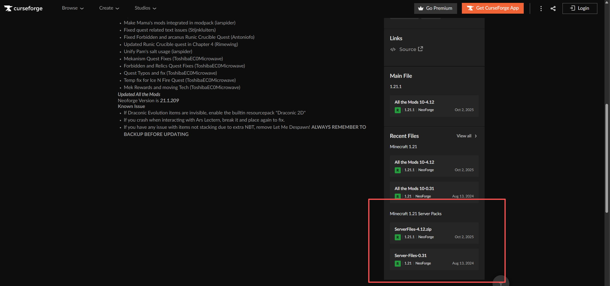
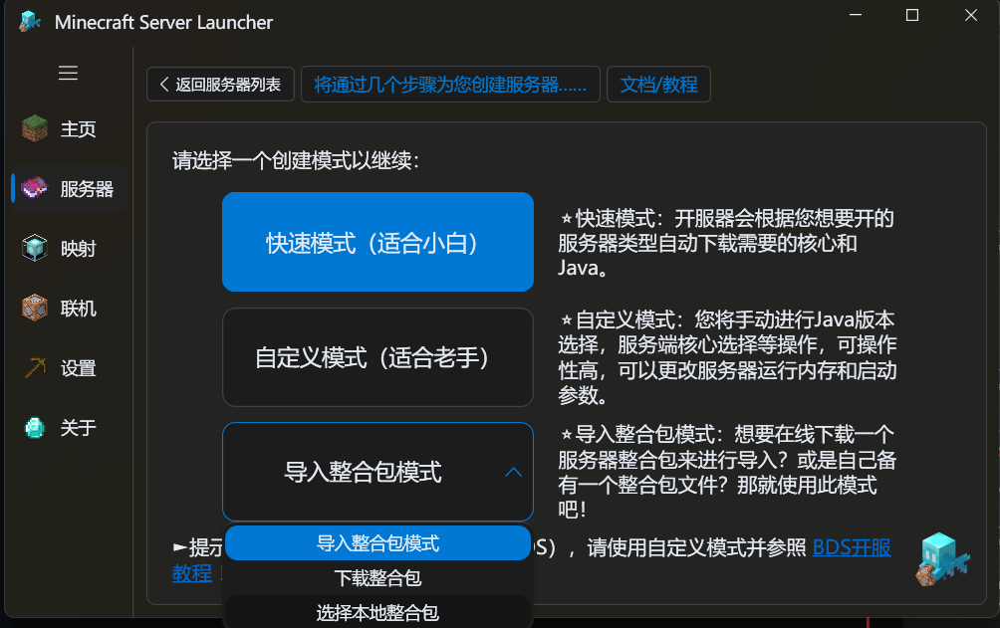

首先，先确保你要导入整合包的类型为 ==服务端== （带有server或服务端字样）。

就像这样，这里的才是 ==服务端整合包== ：

然后进入创建服务器的页面，选择导入服务端整合包模式。

然后选择你下载整合包的位置，选择好之后就可以一直点击下一步，接下来的流程和正常开服流程一致。

::: tip 提示未找到服务端核心？

可能是因为服务端内置了NeoForge/Forge的安装程序，这个时候只需要按照提示， ==在MSL中下载一个对应版本的NeoForge/Forge/Fabric的服务端核心即可==。

:::

::: warning

注意：部分整合包作者比较贴心，分为server和java这俩文件夹，此时你需要自己解压并且把server文件夹的东西压缩，然后才能导入。

:::

