::: important 运行环境
若您无法打开软件，请下载运行环境！（一般Windows10及以上系统自带）  
运行环境: ==.Net Framework 4.7.2=={.important}

<LinkCard title="下载 .Net Framework 4.7.2" icon="download" href="https://dotnet.microsoft.com/en-us/download/dotnet-framework/thank-you/net472-developer-pack-offline-installer" description="点击跳转到微软官方下载地址。" />

**不建议将MSL放置于磁盘根目录或C盘某些特殊目录（如临时目录或需要管理员权限的目录），否则后果自负！**

**建议在使用MSL时给软件所处目录添加至杀毒软件信任区中，或在杀软提示时及时添加信任，防止误杀**。

:::

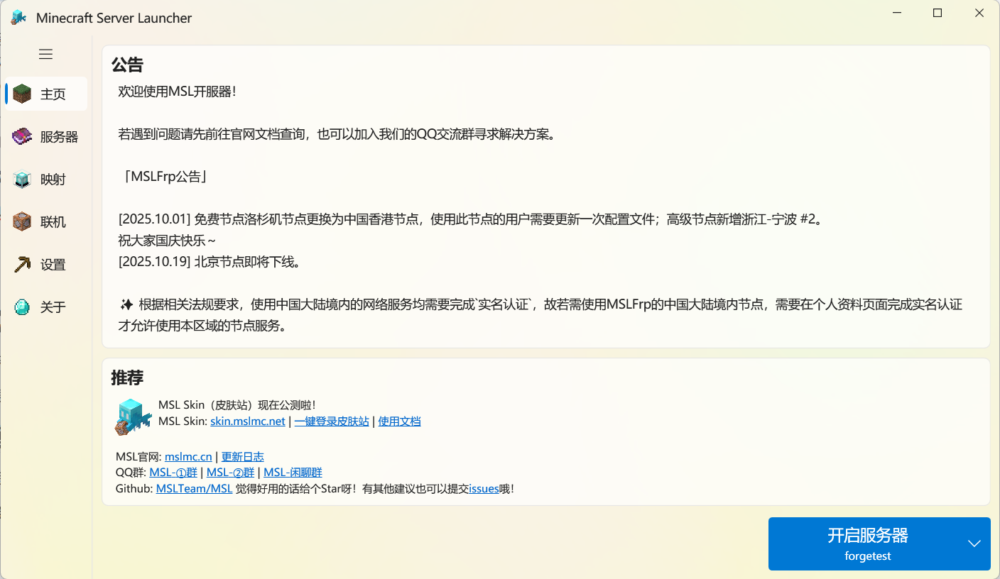

## 快速模式

根据==软件内提示==完成即可,此处不再赘述。

::: warning 注意

建议您设置的服务端文件夹位置==不包含=={.warning}中文名，

否则可能会导致一些错误的产生。

:::

## 自定义模式

:::: steps

1. ### 填写基本信息

   填写您的服务器名称和存放的文件夹位置（存放的文件夹位置可以选择一个新的文件夹，也可以选择已有服务端的文件夹）。

   如果您有==选择困难症==，那么可以保持默认，默认将保存在 ==/MSL/Server/== 文件夹内。

   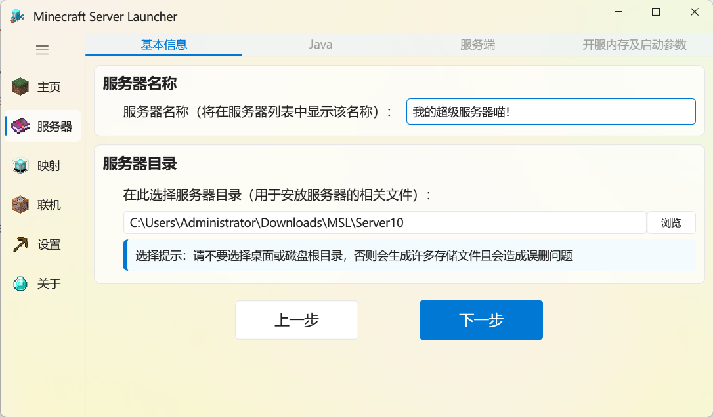

2. ### 选择Java版本

   根据您需要开的MC服务器版本，按照右边的提示选择合适的Java版本。

   若您不确定您电脑上的Java是否合适，建议您选择==开服器下载==。

   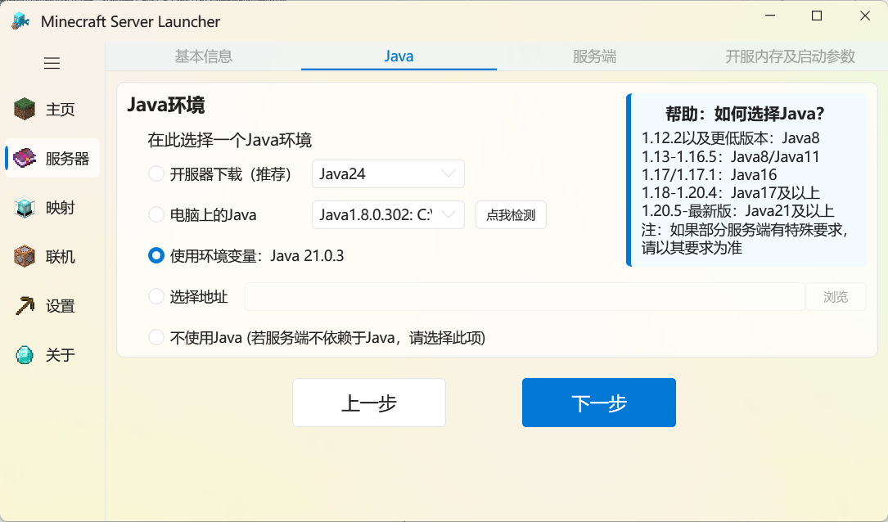

3. ### 选择服务端

      建议直接选择==开服器==下载，我们为您准备了诸多类型的服务端，并且均为==高速下载==。

      <LinkCard title="不会选择服务端？" icon="circle-question" href="/docs/mc-server/choose-server-tips/" description="在这里查看选择服务端的教程！" />

      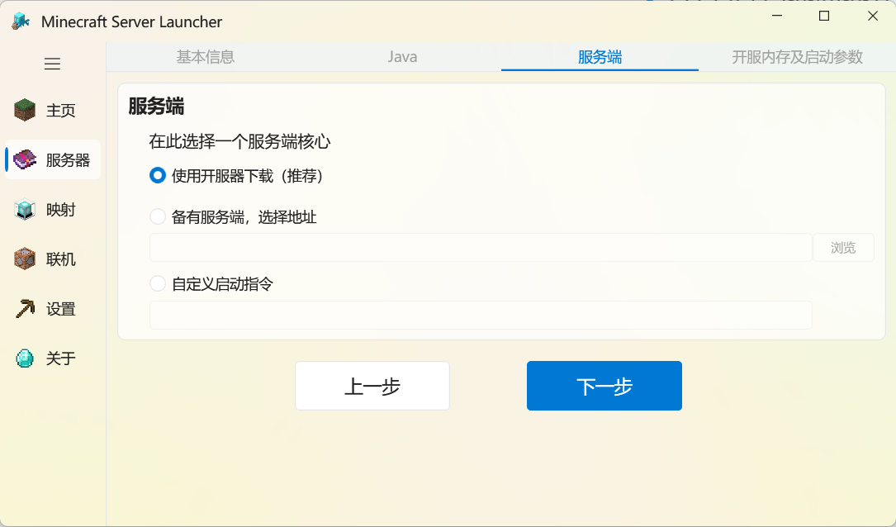

      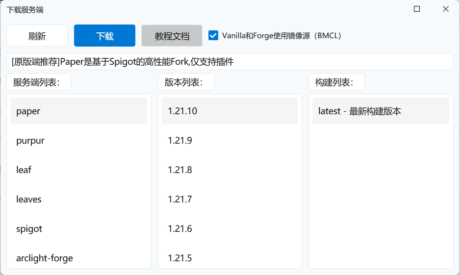

4. ### 配置服务器参数

     ::: tip 如果您是新手，不知道如何填写这些参数，那么直接点击 ==下一步== 即可。

     :::


     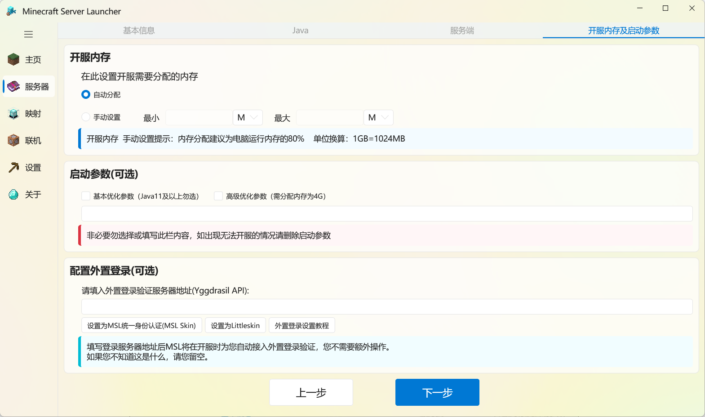

5. ###  选择终端模式

     ::: tip 比较建议选择 ==传统终端== 模式，伪终端模式可能存在些许小问题。

     :::

     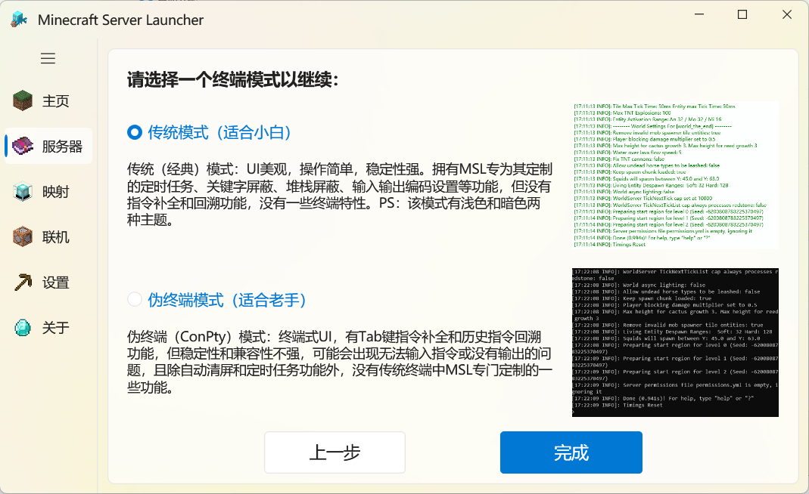

6. ### 配置完成，开启您的服务器即可

     ::: tip 记得同意EULA哦~

     :::

     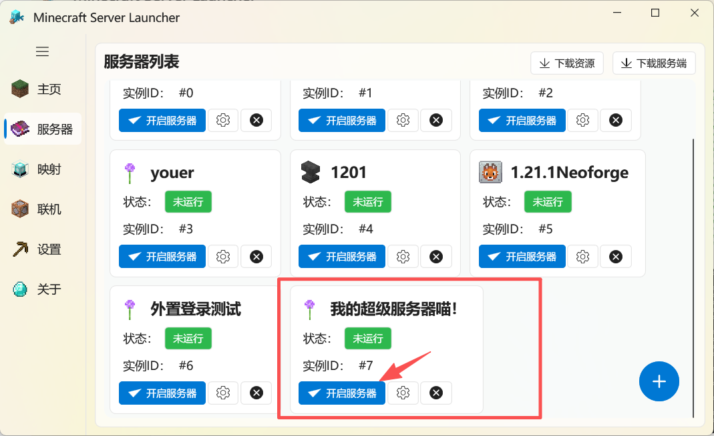

     出现 ==开服成功== 的提示就代表成功开启您的服务器啦！

     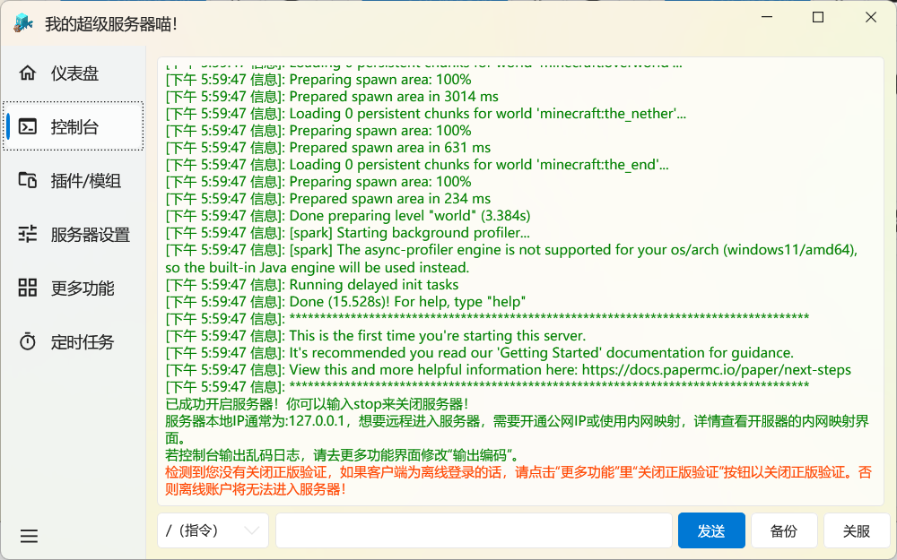

7. ### 连接到您的服务器

     如果您的服务器和您的游戏客户端是同一台电脑上，那么您可以直接在MC中输入以下地址进入您的服务器。

     ```
     127.0.0.1
     ```

     如果您正在使用带有公网IP的云服务器/您的电脑有公网IP，可以在放行防火墙后使用您的公网IP连接游戏。

     <LinkCard title="配置内网穿透" icon="book" href="/docs/proxy/frp/" description="如果您没有公网IP，那么点这查看如何配置内网穿透吧！<br>让其他人也能访问您的服务器！" />

::::

## 导入已有服务端资源

:::: steps

1. ### 开始导入 & 配置路径

   首先，选择 ==自定义模式== 。

   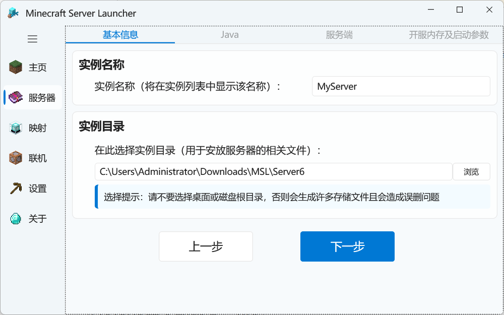

   找到你需要导入的服务端的文件夹所在的路径（可以点击浏览进行选择，也可以直接复制路径粘贴进去）。

   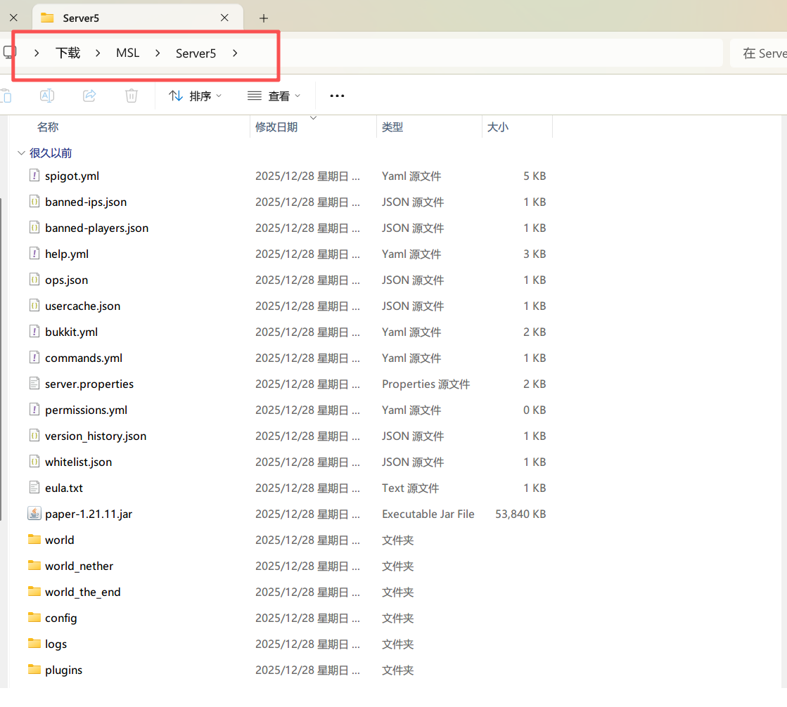

   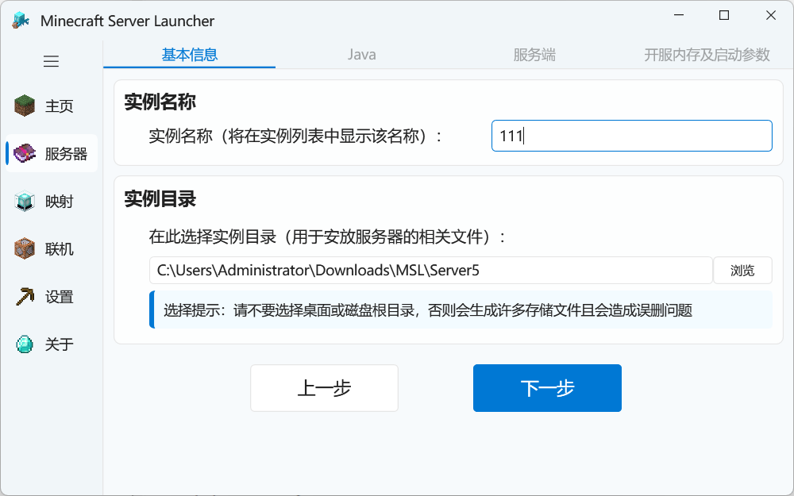

2. ### 选择Java版本和服务端核心

   java选回原来的即可。

   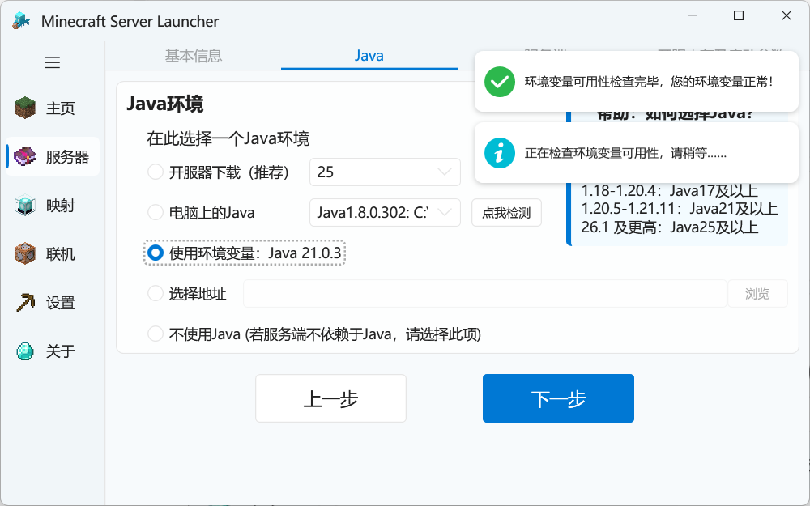

   服务端核心，一般选择 ==备有服务端== ，然后选择你文件夹里面的jar文件即可。

   注意：如果是纯neoforge/forge端，是没有jar核心在最外层的，此时可以选择下载服务端。

   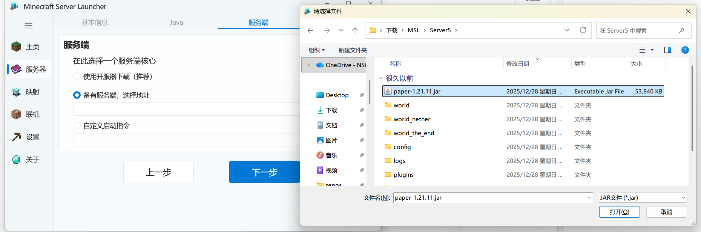

   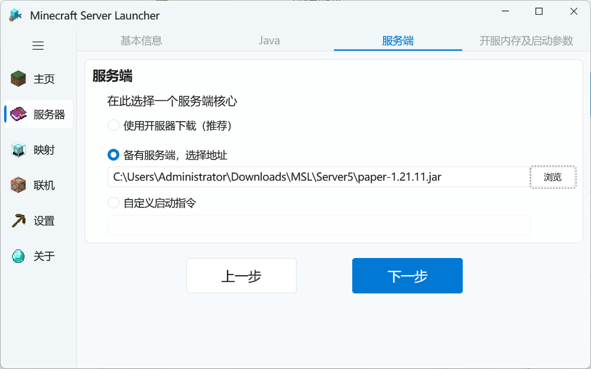

   剩下的按需填写即可。

   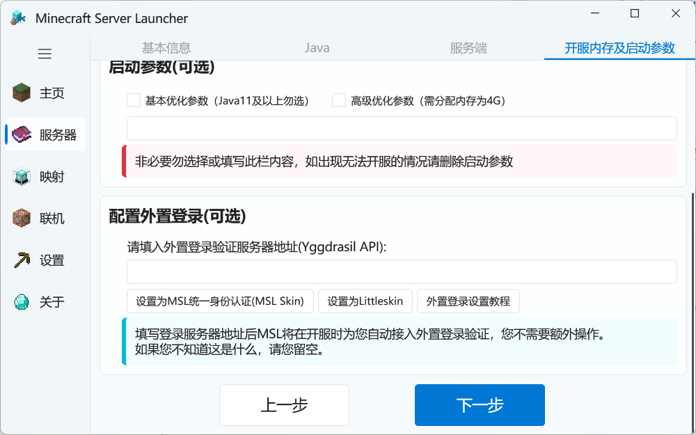

3. ### 继续开服~

   正常开服即可。

   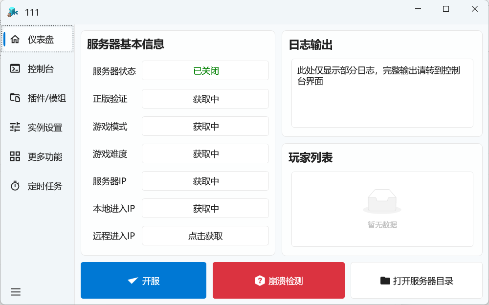

::::

## 视频教程

::: tip

本视频是使用较旧版本的MSL制作的，部分内容可能==已经过时==

建议参考上方文字教程哦！

:::

@[bilibili](BV1au4y1d7Td)
