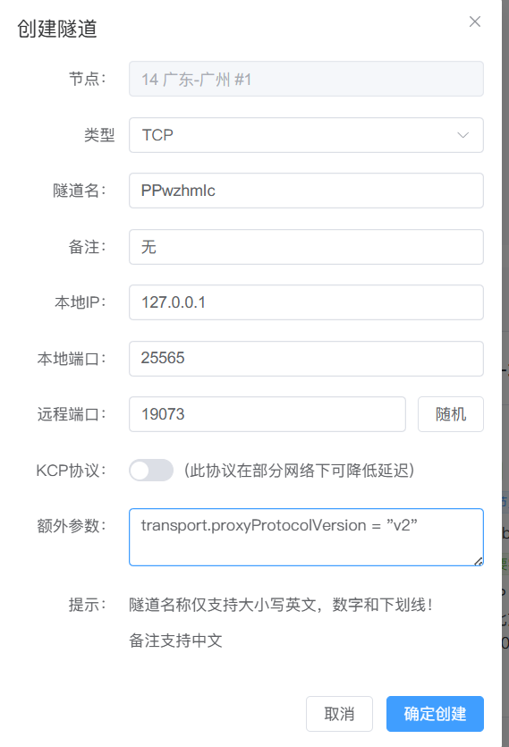
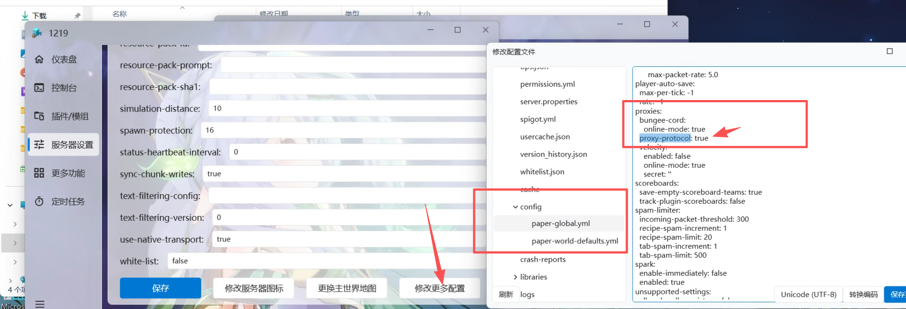
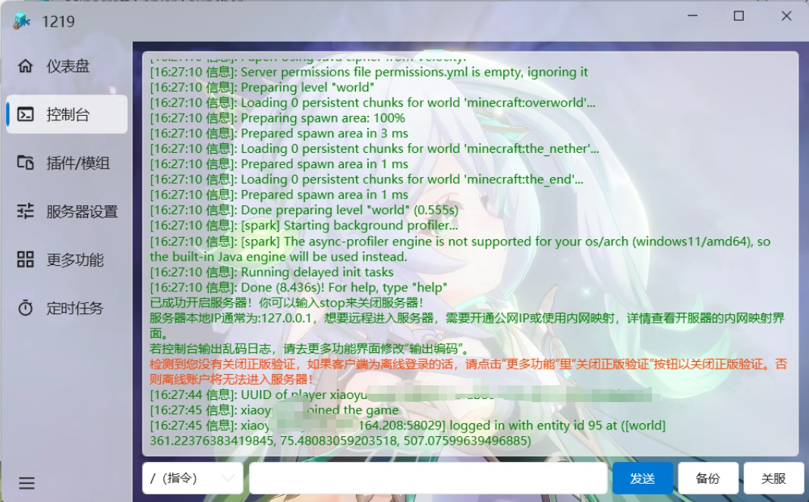

默认情况下，开启Frp后，MC服务器获取到的IP均为本地回环地址`127.0.0.1`。

按照以下操作即可开启frp的`proxy protocol`协议以支持获取用户真实IP。

::: warning 注意

开启此协议需要您正在使用的服务端 ==支持proxy protocol=={.warning} 协议。

并且大部分情况下，启用此协议支持后您 ==无法再通过非代理地址=={.warning}（即内网/本地IP地址）直接进入您的服务器。

:::

:::: steps

1. ### 配置隧道参数

   这里以 ==MSLFrp== 为例进行配置，其他Frp服务商请自行寻找相关配置方法或者自行修改Frpc配置文件。

   首先，在创建隧道的时候填写开启协议支持的额外参数：

   ```toml
   transport.proxyProtocolVersion = "v2"
   ```

   

   

   然后按照正常步骤启动Frp隧道。

2. ### 配置服务端协议支持

   接下来需要配置服务端的支持（这里以paper端为例）。

   ::: warning 注意

   ==并非所有服务端都支持此协议=={.warning}，例如Spigot端就不支持。

   ==大部分的paper及其下游服务端=={.warning} 是支持的，其他服务端可以自行寻找模组/插件进行支持。

   :::

   找到paper的配置文件`config\paper-global.yaml`，找到配置组`proxies`，将配置项`proxy-protocol`修改为`true`即可，而后重启您的服务端就完成了所有的配置流程。

   

   玩家再次加入服务器时，即可正常获取真实的IP。

   

::::

::: tip 其他支持方案

- 使用[Velocity](https://papermc.io/software/velocity)代理端嵌套您的插件/模组服务端以实现（此代理端支持上述proxy协议），可能需要配合此模组：[Proxy Compatible Forge - MC百科](https://www.mcmod.cn/class/13564.html) 或者此插件：[Ambassador - Minecraft Plugin](https://modrinth.com/plugin/ambassador/versions)。
- Fabric可以看看这个模组（似乎很久没更新了）：[Proxy Protocol Support - Minecraft Mod](https://modrinth.com/mod/proxy-protocol-support/versions)。
- 对于模组端，可能更加通用的方案仍然是使用上述所说的代理端。

:::
