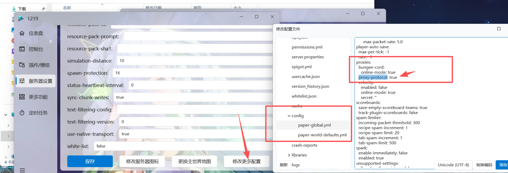

## [MSL Frp](https://user.mslmc.net/)

首先，切换到`映射`选项卡，然后点击`添加隧道`。


根据提示，输入`账号密码登录`。

若未注册MSL账户，请先前往[MSL用户中心](https://user.mslmc.net)注册账户。

进入创建隧道选项卡，选择就近的节点，填写相应的参数（如果不懂，那就不要改就好啦）。`KCP`一般不建议开。


创建隧道后，选择你创建的隧道，点击`选择该隧道`即可。


回到`隧道`选项卡主页，`双击`你刚才创建的隧道进入启动页面。


启动隧道，成功后即可使用连接地址进入您的MC服务器。


## [高级配置]获取用户真实IP

默认情况下，开启Frp后，MC服务器获取到的IP均为本地回环地址`127.0.0.1`。

按照以下操作即可开启frp的`proxy protocol`协议以支持获取用户真实IP。

::: warning 注意

开启此协议需要您正在使用的服务端支持proxy protocol协议。

并且大部分情况下，启用此协议支持后您无法再通过非代理地址（即内网/本地IP地址）直接进入您的服务器。

:::

这里以`MSLFrp`为例进行配置，其他Frp服务商请自行寻找相关配置方法或者自行修改Frpc配置文件。

首先，在创建隧道的时候填写开启协议支持的额外参数：

```toml
transport.proxyProtocolVersion = "v2"
```


然后按照正常步骤启动Frp隧道。

接下来需要配置服务端的支持（这里以paper端为例子）。

::: warning 注意

并非所有服务端都支持此协议，例如Spigot端就不支持。

大部分的paper及其下游服务端是支持的，其他服务端可以自行寻找模组/插件进行支持。

:::

找到paper的配置文件`config\paper-global.yaml`，找到配置组`proxies`，将配置项`proxy-protocol`修改为`true`即可，而后重启您的服务端就完成了所有的配置流程。



玩家再次加入服务器时，即可正常获取真实的IP。


::: tip 其他支持方案

- 使用[Velocity](https://papermc.io/software/velocity)代理端嵌套您的插件/模组服务端以实现（此代理端支持上述proxy协议），可能需要配合此模组：[Proxy Compatible Forge - MC百科](https://www.mcmod.cn/class/13564.html) 或者此插件：[Ambassador - Minecraft Plugin](https://modrinth.com/plugin/ambassador/versions)。
- Fabric可以看看这个模组（似乎很久没更新了）：[Proxy Protocol Support - Minecraft Mod](https://modrinth.com/mod/proxy-protocol-support/versions)。
- 对于模组端，可能更加通用的方案仍然是使用上述所说的代理端。

:::

## 其它Frp

在这里可以选择其他服务商，按照提示登录即可~

目前支持的第三方服务商：OpenFrp，Sakura Frp，ChmlFrp，ME Frp


## 自定义Frp

粘贴配置文件进去就好~（建议`toml`格式）


