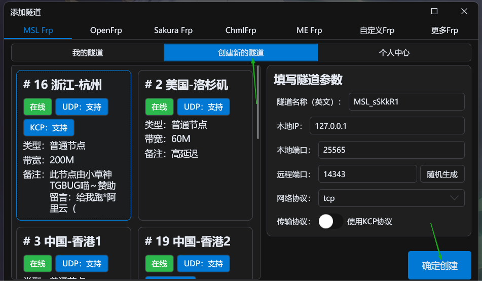

::: tip 内网穿透（Frp）

[这是什么？ 前往**GoFrp项目官网** 了解](https://gofrp.org/zh-cn/){.readmore}

简单来说，就是把 ==内网的服务映射到公网== 。

由于很多家庭宽带是不提供 ==公网IP== 的，想用家里的电脑/没有公网IP的设备开服就需要用到内网映射服务，将您的服务器映射到公网以让其他小伙伴加入游玩！

:::

## MSLFrp

<LinkCard title="MSLFrp" icon="cloud" href="https://user.mslmc.net" >

MSLFrp是嵌套于 ==MSL用户中心== 的服务。

本服务由MSLTeam与广州兮辰云科技联合提供。

</LinkCard>

首先，切换到 ==映射== 选项卡，然后点击 ==添加隧道==。

根据提示，输入 =账号密码登录=。

若未注册MSL账户，请先前往 ==MSL用户中心== 注册账户。

[MSL用户中心](https://user.mslmc.net){.readmore}

进入创建隧道选项卡，选择就近的节点，填写相应的参数（特别是本地端口需要对应MC服务端配置的端口）（如果不懂，那就不要改就好啦）。==KCP一般不建议开==。

创建隧道后，选择你创建的隧道，点击 ==选择该隧道== 即可。

回到 ==隧道== 选项卡主页，==双击== 你刚才创建的隧道进入启动页面。

==启动== 隧道，成功后即可使用 ==连接地址== 进入您的MC服务器。

::: tip

由于内网穿透的特性，默认情况下通过内网穿透进入的玩家IP都是`127.0.0.1`。

这可能导致部分登录插件识别到是同一台电脑的玩家登录，也可能导致封禁使用`/ban-ip`后全员进不去。

通过调整登录插件的配置，以及不使用`/ban-ip`是个比较好并且简单的方案（或者使用外置验证登录）。

如果还是希望获取玩家真实IP，请看这里：

[教程 - **Frp获取用户真实IP**](/docs/proxy/frp-real-ip/){.readmore}

:::

## 其它Frp

在这里可以选择其他服务商，按照提示登录即可~

配置流程与MSLFrp类似。

目前支持的第三方服务商：OpenFrp，Sakura Frp，ChmlFrp，ME Frp

## 自定义Frp

选择 ==高级模式=，粘贴配置文件进去就好~（建议`toml`格式）。

通过此模式您可以快速启动MSL尚未接入的第三方Frp服务提供商。

也可以用引导模式，这个比较适用于自建Frp服务。
