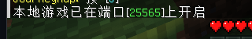
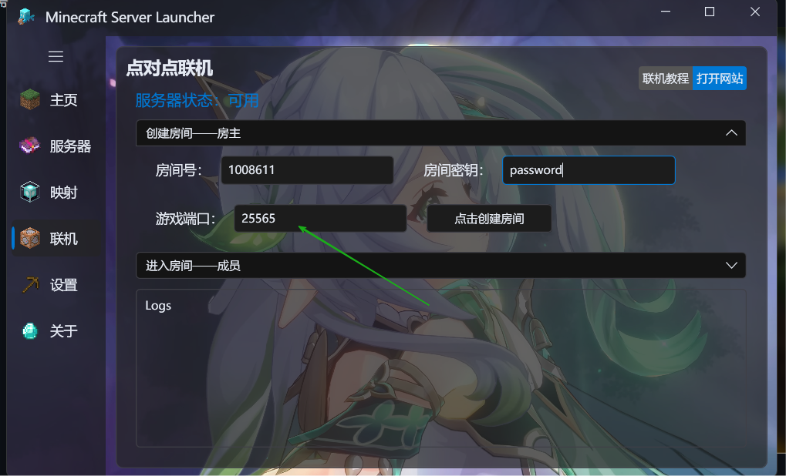
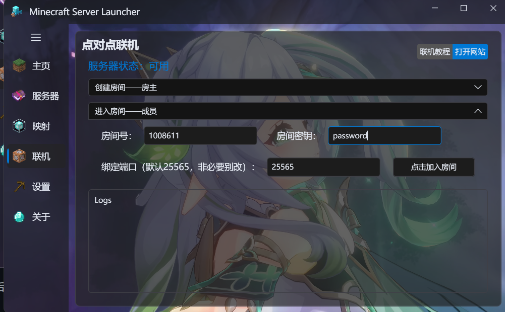
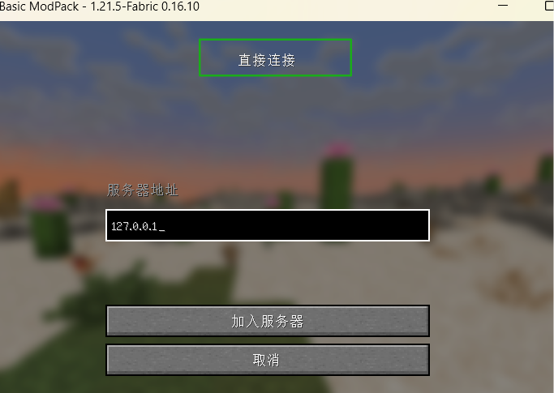

::: tip TIPS
点对点联机功能 ==无法穿透所有类型的NAT== ，如果你无法成功联机，请使用 ==内网映射== 功能  
由于Minecraft的限制，可能仅 ==正版用户== 才能成功联机，若你是离线用户，请 ==开服务器== 或者安装相关模组进行联机。
:::

## 房主部分

:::: steps

1. 下载与你的客户端对应的自定义联机模组（这是可选的，但是用了模组可以固定端口 / 关闭正版验证）。

   [**mcwifipnp** 更高级联机设置 (LAN World Plug-n-Play)](https://www.mcmod.cn/class/4498.html){.readmore}

2. 启动游戏，进入一个单人世界。

3. 按ESC，呼出游戏菜单。

4. 点击 ==对局域网络开放== 。

   

5. 根据个人需要调整配置并确认。

   

6. 游戏左下角会给你一个 ==端口==，将此端口填入点对点联机的端口中。

   

7. 点对点联机中的QQ号（==房间号==）填你自己的即可，==密钥== 为其他玩家加入房间需填写的密码。

   

8. 配置完成后，点击 ==开启房间== ，即可让你的朋友加入。

::::

## 成员部分

:::: steps

1. 将房主给你的QQ号（==房间号==），==密钥== 填入开服器。

2. 端口号默认为25565即可，成员 ==无需像房主那样更改端口号==。

   

3. 配置完成后，点击 ==加入房间== ，即可进行连接。

4. 连接成功后，进入和房主 ==版本一致的Minecraft客户端== 。

5. 点击 ==多人游戏== 。

6. 点击 ==直接连接==（或 ==添加服务器==）。

7. 在地址栏填写`127.0.0.1`（如果你更改了端口号，请在127.0.0.1后面加上半角冒号+你更改后的端口号，如：127.0.0.1:12337）

   

8. 然后即可成功联机。

::::