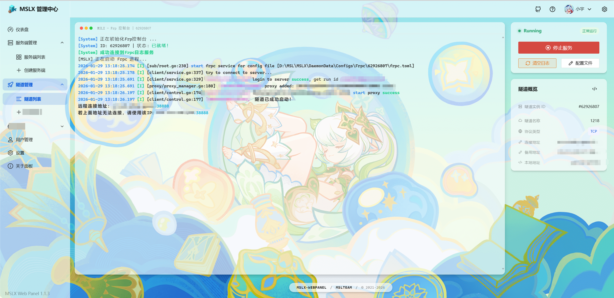
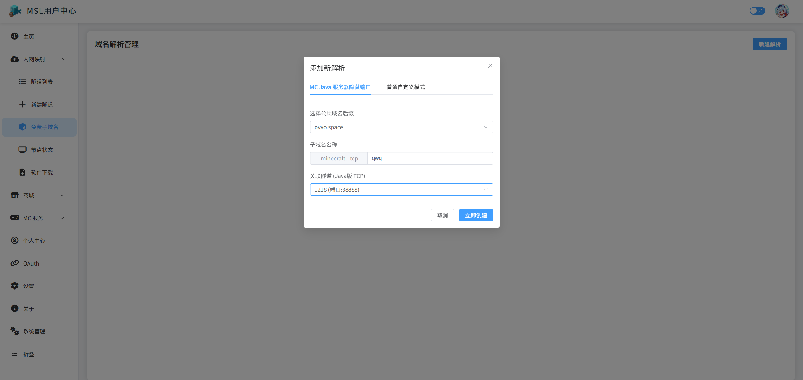
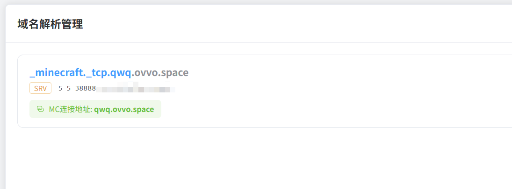
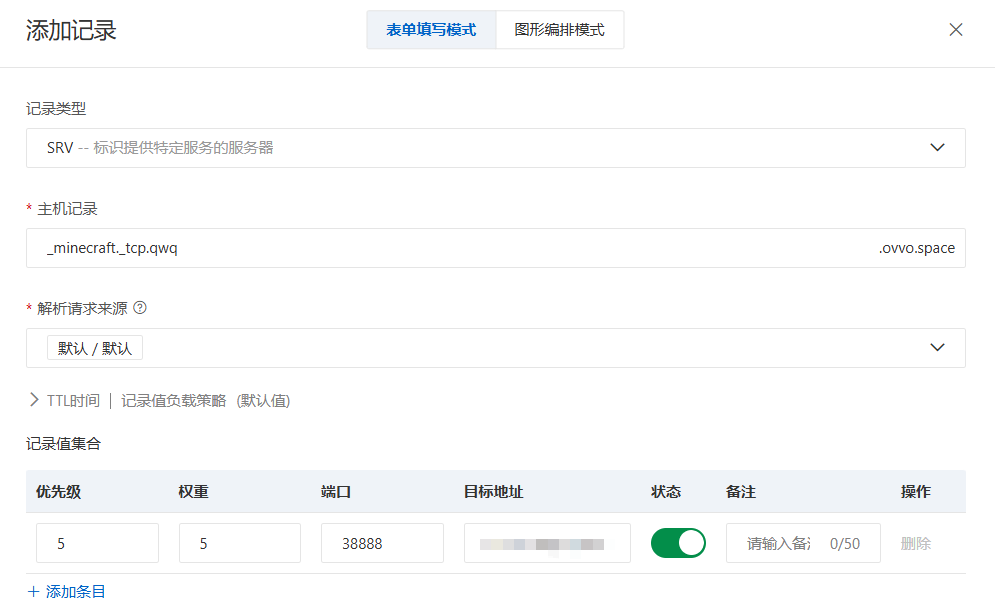

::: tip  带端口的域名很难看（如 xxx.xx:12345）？本篇教程可以教您使用域名SRV解析隐藏端口！（仅限Java版）

:::

::: warning 经过测试，不一定所有的DNS服务都支持解析SRV记录，部分运营商的DNS服务可能会无法解析，切换到阿里云等其他常见的公共DNS可以解决。

:::

## 使用 MSLFrp 自带的子域名服务

::: tip 如果您正在使用 ==MSLFrp== 并且没有您自己的域名，可以使用 MSLFrp 自带的子域服务。

:::

创建并启动您的隧道，映射Minecraft 服务。

映射成功后，前往MSL用户中心的子域服务页面。点击添加解析记录。

[MSLFrp-子域服务 | MSL用户中心](https://user.mslmc.net/frp/dns){.readmore}

选择一个你心仪的域名后缀，然后填写子域名前缀和选择你刚才创建（启动）的那条Frp隧道，点击创建即可自动解析成功。

::: info 子域名前缀什么意思？

比如，你选择的公共域名后缀为`ovvo.space`。你想使用`qwq.ovvo.space`作为你的MC服务器连接地址。

那么就在子域名称处填写`qwq`即可。

:::

创建成功后，会显示您的连接地址，使用此地址即可进入您的服务器。

## 使用自定义域名实现

::: important 这需要您自己有一个域名！如果只是用于MC隐藏端口，没有强制备案要求。

:::

进入您的域名服务商解析控制台，添加解析记录。（这里以阿里云为例）。

域名记录选择 `SRV`，主机记录填写 `_minecraft._tcp.自定义子域名前缀`。

记录值：优先级和权重都写 `5` 即可（如果你有多个地址那就自己考虑了，一般统一写5即可）。

端口填写 ==您Frp服务商隧道的端口/服务器的端口==，目标地址填写 ==您Frp服务商隧道的连接地址/服务器IP地址== （允许填写IP地址/域名）。

创建成功后即可使用此地址连接。

假如您的域名是xxx.cn，填写的连接地址是`_minecraft._tcp.qwq`，那么连接地址就是`qwq.xxx.cn`。
