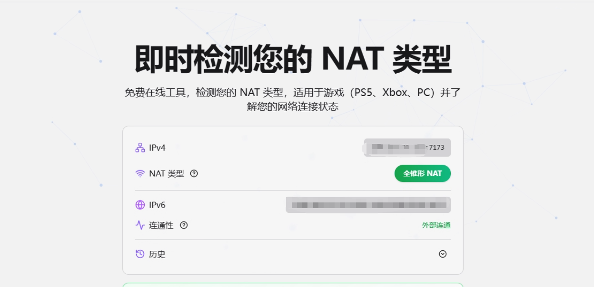
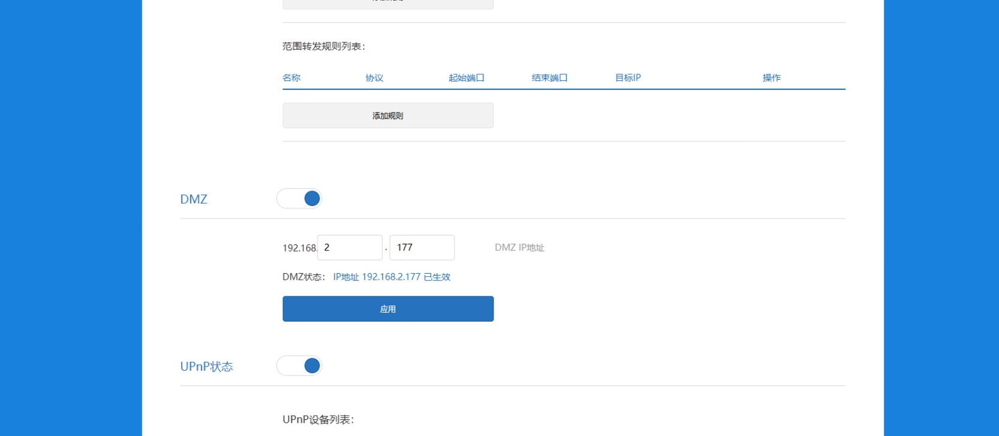
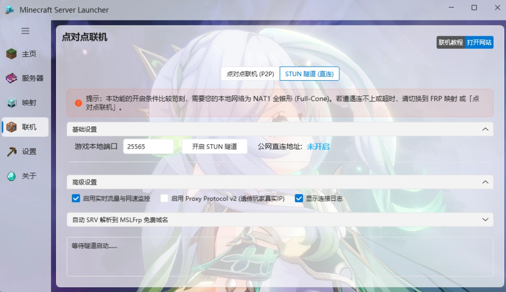
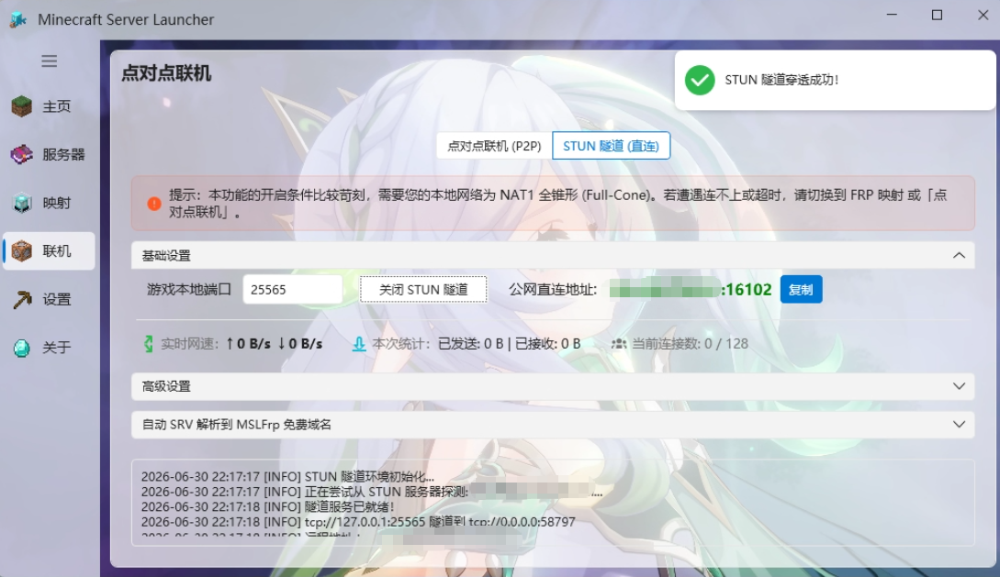
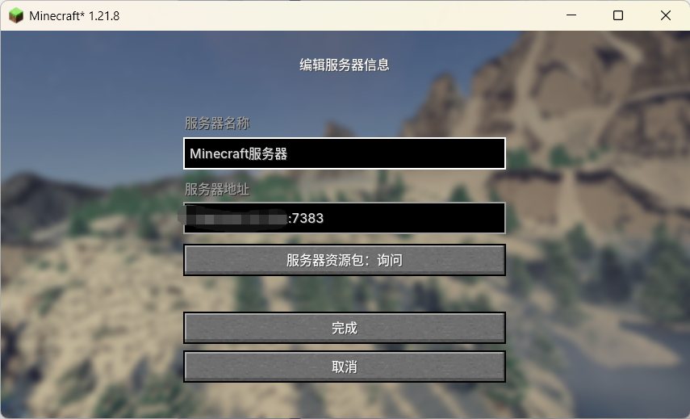
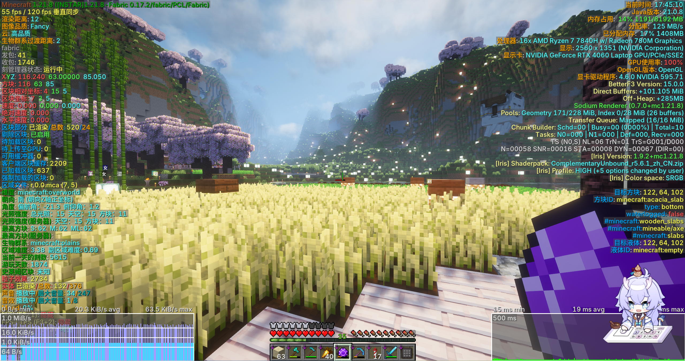
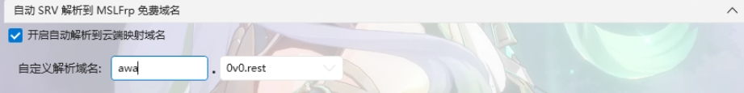

## 功能介绍

STUN技术允许 ==**NAT1** 全锥形== 网络环境下的设备向出口公网IP ==*借一个端口*== ，实现内网穿透访问。

功能入口位于MSL软件中的 **「联机」** - **「STUN隧道」** 位置。

使用此联机方法，仅需要服主进行 ==启动隧道服务== ，玩家不需要像点对点联机那样加入房间。服主可以获得一个 ==公网直连地址== 。

::: warning 适用条件

STUN隧道仅适用于 ==NAT1 全锥形=={.warning} 的网络类型，其他NAT类型均不支持打通此隧道。如果你一点也听不懂，建议您使用 **Frp隧道** 或者点对点联机服务。

MSL 从 `v3.7.5.2` 版本起支持本功能。

:::

::: important 此功能穿透仅用于体验，无法保证公网IP和端口的**变化频率**，此方案 ==没有稳定性保障=={.important}，我们也不会额外提供相关的技术支持。

:::

## 确定是否有条件使用STUN隧道

如上文所述，您需要 ==NAT1 全锥形== 的网络环境才可以使用STUN隧道，没有的话可以出门右转用Frp隧道了。

可以用这个网站：[NAT Checker - 免费在线 NAT 类型检测工具](https://natchecker.com/zh#faq-nat-type)

如果是 ==全锥形NAT==，那么可以继续。**否则请不要进行下一步**。

::: tip 不是 NAT1 的解决小技巧⬇️⬇️⬇️

==在调整路由器设置时，请确保您有相关知识，否则仍然不建议您操作。以免导致网都没了。==

NAT类型部分取决于运营商，并非所有情况都能变成NAT1.

①上网方式修改为光猫桥接-路由器拨号上网。

②在路由器设置DMZ主机为你的电脑的局域网IP地址。

③如果仍无法解决，可以上网搜索相关内容。更建议更换使用 **Frp隧道** 或点对点联机服务。

!!无法变成NAT1也是正常的，可能是被运营商限制了，那就不是技术问题而是处世哲学的问题了。!!

:::

## 使用指南

:::: steps

1. ### 检查NAT类型，确定是NAT1。

   

   详细方法上面已经说明了，此处不再赘述。如果不是NAT1，就算下面成功显示了地址，那也连不上的。

   !!不信邪欢迎试试喵~!!

   

2. ### 启动STUN隧道

   前往MSL的 ==联机== 页面，切换到 ==STUN隧道== ，输入您的本地 `服务器端口/联机显示的端口`，点击启动即可。

   记得放行或关闭**防火墙**哦。

   ::: tip 高级设置如果不知道是什么意思，请不要随意修改，保持默认即可。特别是Proxy Protocol V2协议，错误的开启会导致服务器无法连接。

   :::

   

   启动成功会显示穿透成功的公网IP地址。

   

3. ### 连接 & 注意事项

   玩家直接复制 ==远程地址== 到MC游戏添加服务器即可连接，玩家**不需要进行加入房间等操作**。

   ::: tip 如果无法连接服务器，请首先检查防火墙是否放行/关闭。若防火墙已通过仍连不上，很大可能是因为**非NAT1**环境，可以准备放弃了。

   :::

   

   

   

   !!白天，同省的延迟还是很低的，但是晚上就不一定咯~!!

::::

## 高级设置

### 实时流量监控 & 连接日志

字面意思的功能了，默认开启，没什么好解释的，不懂的应该问语文老师。

### Proxy Protocol V2 用户真实IP透传

由于STUN隧道会在本地进行代理一次，导致MC服务器读取玩家IP均为`127.0.0.1`，若需要透传真实IP需要启用此功能，并 ==开启服务端的HAProxy支持== 。（部分服务端原生支持，部分服务端可以通过安装插件/模组实现）。

[详情可以看这里 => **隧道获取用户真实IP** (原理是一样的)](/docs/proxy/frp-real-ip/){.readmore}

### 自动 SRV 解析到 MSLFrp 免费域名

由于STUN隧道的IP和端口可能经常变化，MSL内提供了自动解析功能。!!（但是接入各大DNS解析SDK还是麻烦了一点，目前仅支持使用MSLFrp提供的免费子域名功能）!!

使用方法很简单，在「映射」页面登录一次MSLFrp账号，然后填入喜欢的域名前缀即可。启动隧道后/地址变更时，会自动更新解析记录。

配置完成后可以使用这个域名直接进入服务器（不需要加端口）。

::: important 注意：解析是A+SRV记录的，所以会产生两条解析记录，注意不要误删A记录哦，否则SRV记录也是无法连接的。（SRV记录不支持目标填写纯IP）。

:::

## 注意事项

- STUN隧道的IP地址和端口都是**随时可能变化**的，这取决于运营商配置。
- 远程地址的IP和端口**均无法自定义**。
